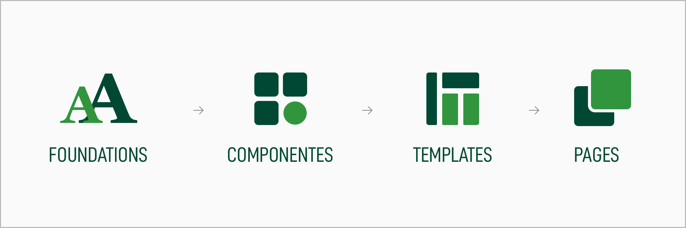

# Locker Room

Locker room is a design language that provides a common framework for building interfaces within the [Paddy Power↗](https://paddypowerbetfair.jobs/) product ecosystem. It is a guide to foundations, components, patterns, and use cases that provide consistency and coherence to our products, and, ultimately, provides a satisfactory and unified experience to its users.

Locker Room bring order and consistency to digital products. It helps to protect the brand, elevate the user experience, and increase the efficiency of how we design and build. The design and rules of a system are not set in stone, they are a constant work in progress, open to iteration to improve, adapt and grow.

## Who is locker room for?

Locker Room is the official implementation of the [Paddy Power↗](https://paddypowerbetfair.jobs/) Design Language for product, tech and designers, and represents an ever-growing ecosystem of design assets and guidance.

### Goals

#### **Scale** 📐

Increased efficiency and consistency lead a company to build faster products at scale.

#### **Efficiency** 👌

Enable designers & developers to reuse components and thereby increase efficiency.

#### **Consistency** 😎

It becomes much easier to create consistent experiences across different platforms with a shred set of principles and rules to build components.

## System breakdown

The way we think about system design for comparison to the [atomic approach ↗](https://medium.com/r/?url=http%3A%2F%2Fbradfrost.com%2Fblog%2Fpost%2Fatomic-web-design%2F) .

### Foundations

Foundations have things that are applicable to all our digital products. These can be tone, principles and accessibility. They are also specific to a particular product(s), and cover guidelines for things like [typography](http://abacus.sct.dev.betfair/docs/#/foundations/typography/), [colour](http://abacus.sct.dev.betfair/docs/#/foundations/colour/) and [spacing](http://abacus.sct.dev.betfair/docs/#/foundations/spacing/).

### Components

Components refers to distinctive user interface elements that are used over and over throughout a product i.e. [button](http://abacus.sct.dev.betfair/docs/#/components/button/), [toggles](http://abacus.sct.dev.betfair/docs/#/components/toggle/), dropdown, [accordion](http://abacus.sct.dev.betfair/docs/#/components/accordion/) or [slider](http://abacus.sct.dev.betfair/docs/#/components/slider/).

### Templates

A template is the culmination of our foundations and components, put together to form a meaningful UI. Consistency is important for a good user experience, not just in style, but in the way content is presented.

### Pages

A page is the culmination of our templates, put together to form a meaningful UI. They reflect possible usage scenarios of a web application.
