# Badge

## About badges

Badges have a colorful, bold and filled style that makes them stand out within or next to another component.

## Usage

Use badges to draw attention to new or promotional content. Badges should not be clickable.

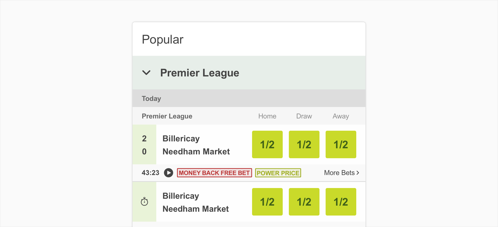

## Structure

You can include an icon in a badge. For maximum visual clarity, system icons are the suggested icon type inside badges. You may also choose to put an icon in a badge without text, but in that case, be sure that the icon is clear enough.

The icon should be aligned to the left.

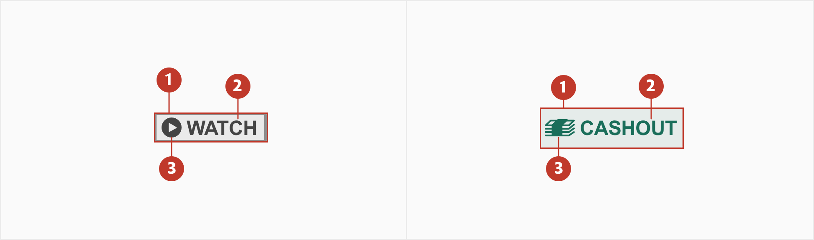

1.**Container**- Surrounds a text label.

2.**Main label-** The label can be a name of a promo or functionally.

3.**Icon(optional)**- Use icons before the label to draw more attention to it, or help convey more meaning.

## Variations

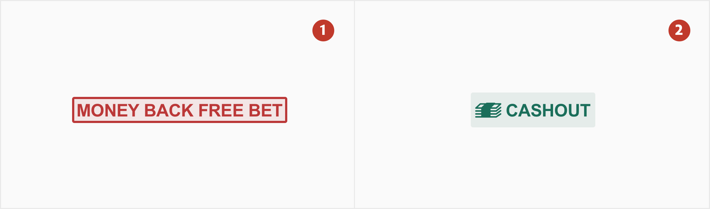

1.**Promo**- Choose a promo badge for promotional information, such as money back free bet, power price, extra place, early payout, no runner no bet and offer .

2.**Special**- For info that is more complimentary, like cash out and best odds guaranted go for a subtle special badge.

## Specs

Badges are small enough to fit next to or within another element.

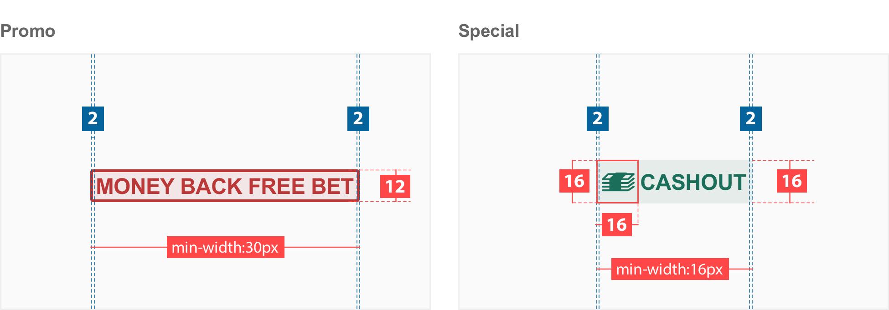

## Colour

### Promo Badge

The promo badges should have different colour to help distinguish them.

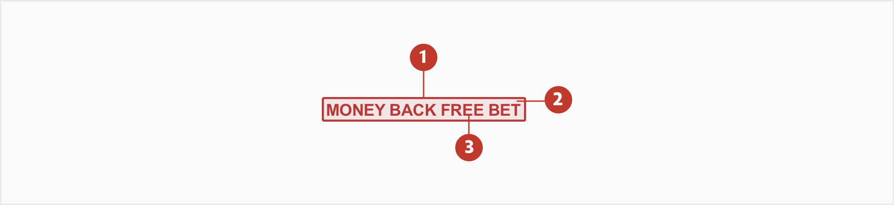

| Element | Category            | Attribute                     | Value                                  |
| ------- | ------------------- | ----------------------------- | -------------------------------------- |
| 1.&3    | Border & Main Label | Token Color Opacity | \$color-red-600 #bb3838 100% |
| 2.      | Background          | Token Color Opacity | \$color-red-600 #bb3838 10%  |

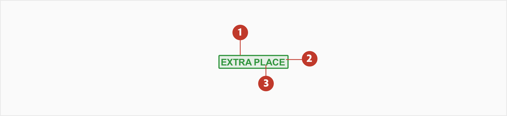

| Element | Category            | Attribute                     | Value                                          |
| ------- | ------------------- | ----------------------------- | ---------------------------------------------- |
| 1. & 3  | Border & Main Label | Token Color Opacity | \$color-brand-secondary #31953e 100% |
| 2.      | Background          | Token Color Opacity | \$color-brand-secondary #31953e 10%  |

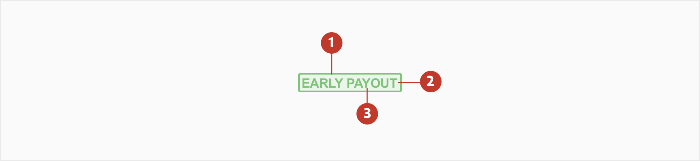

| Element | Category            | Attribute                     | Value                                    |
| ------- | ------------------- | ----------------------------- | ---------------------------------------- |
| 1. & 3  | Border & Main Label | Token Color Opacity | \$color-green-300 #7CC576 100% |
| 2.      | Background          | Token Color Opacity | \$color-green-300 #7CC576 10%  |

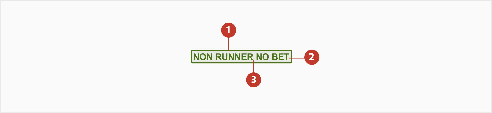

| Element | Category            | Attribute                     | Value                                    |
| ------- | ------------------- | ----------------------------- | ---------------------------------------- |
| 1. & 3  | Border & Main Label | Token Color Opacity | \$color-green-700 #4C721D 100% |
| 2.      | Background          | Token Color Opacity | \$color-green-700 #4C721D 10%  |

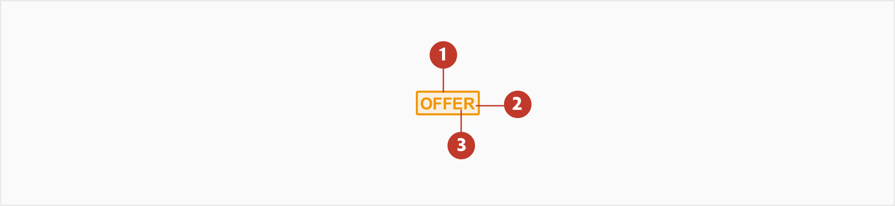

| Element | Category            | Attribute                     | Value                                     |
| ------- | ------------------- | ----------------------------- | ----------------------------------------- |
| 1. & 3  | Border & Main Label | Token Color Opacity | \$color-orange-300 #f29600 100% |
| 2.      | Background          | Token Color Opacity | \$color-orange-300 #f29600 10%  |

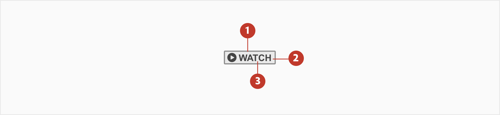

| Element | Category            | Attribute                     | Value                                   |
| ------- | ------------------- | ----------------------------- | --------------------------------------- |
| 1. & 3  | Border & Main Label | Token Color Opacity | \$color-grey-900 #444444 100% |
| 2.      | Background          | Token Color Opacity | \$color-grey-900 #444444 10%  |

### Special Badge

All the special badges should have the same colour and background unlike the promo badges.

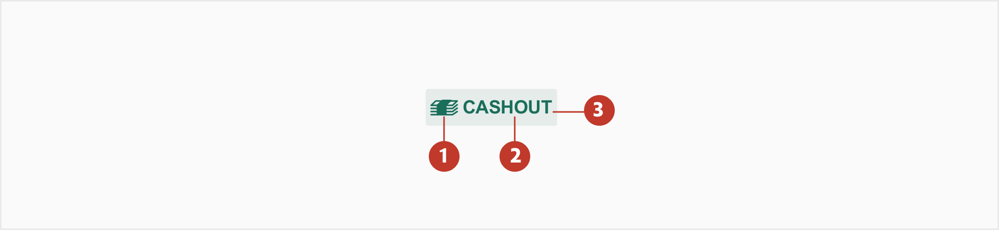

| Element | Category   | Attribute                     | Value                                    |
| ------- | ---------- | ----------------------------- | ---------------------------------------- |
| 1.      | Icon       | Token Color Opacity | \$color-green-800 #1A6E5A 100% |
| 2.      | Main Label | Token Color Opacity | \$color-green-800 #1A6E5A 100% |
| 3.      | Background | Token Color Opacity | \$color-green-800 #1A6E5A 10%  |

## Typography

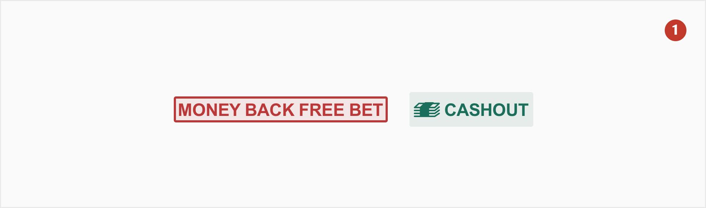

| Element    | Category | Attribute                                     | Value                               |
| ---------- | -------- | --------------------------------------------- | ----------------------------------- |
| Main Label | xSmall   | Typeface Font Size Line height | Arial  Bold 8px 1.25 |
