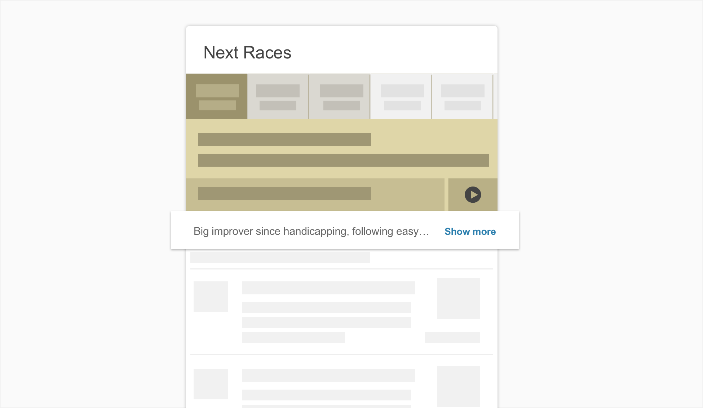
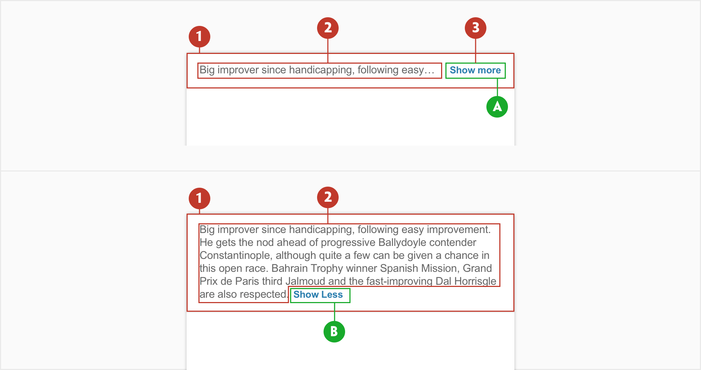
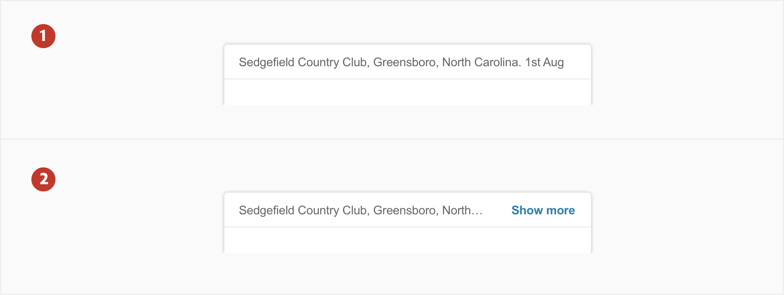
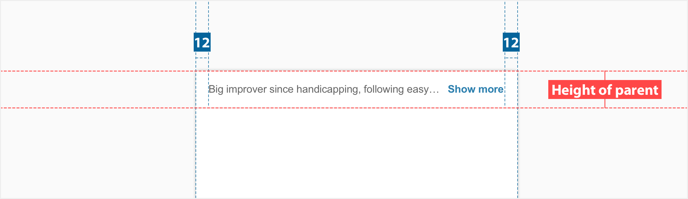

# Blurb

## About Blurb

Blurb is a component used to show information with a **Show more** link option allowing the user to see a detailed version of the information shown. Blurb can be used throughout the platform although it is mostly used to show content regarding markets.\*

## Usage

Use blurb to present a concise view of information. A blurb is, essentially, an abridged section of information giving the ability for a user to see a detailed view by clicking on the show more.

## Structure

An Blurb comprises the following:

1. **Container** - Is around a text label.
2. **Text label** - Text that indicates a detailed version of the information.
3. **Link** - A link denoting Show more **(a)** or Show Less **(b)**

## Types

1. Default Blurb when detailed text label fits inside container. We use elipses when omitting text that

2. Used when detailed text label is larger than the blurb container size.

   We use elipses when shortening text before “Show more”.

## Specs

## Colour

| Element | Category | Attribute                     | Value                                   |
| ------- | -------- | ----------------------------- | --------------------------------------- |
| 1.      | Text     | Token Color Opacity | \$color-grey-800 #666666 100% |
| 2.      | Link     | Token Color Opacity | \$color-link-txt #2C7FAE 100% |
|         |          |                               |                                         |

## Typography

| Element | Category   | Attribute                                     | Value                                   |
| ------- | ---------- | --------------------------------------------- | --------------------------------------- |
| 1       | xSmall     | Typeface Font Size Line height | Arial  Regular 10px 1.17 |
| 2       | xSmallBold | Typeface Font Size Line height | Arial  Bold 10px 1.2     |
