# Buttons

## About buttons

Buttons are used to trigger actions. There are a variety of different button styles applied throughout our products each used to represent a specific type of action.

The button label uses sentence case and are as short as possible, while clearly explaining what happens when the button is clicked.

Avoid using disabled buttons to prevent users from completing an intended action without providing an explanation as to why the button has been disabled.

## Usage

They are placed throughout the UI, in places like:

- Cards

- Forms

- Modals

- Sidebar

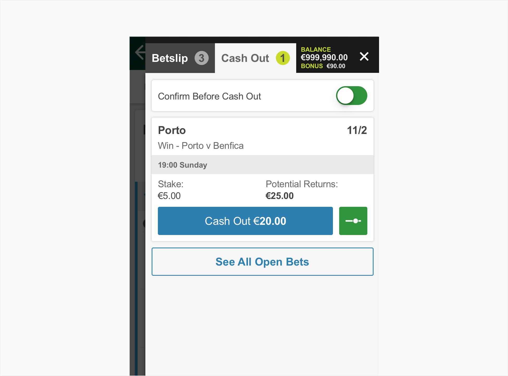

## Structure

Buttons can contain a combination of a clear label and an icon while links are always text.

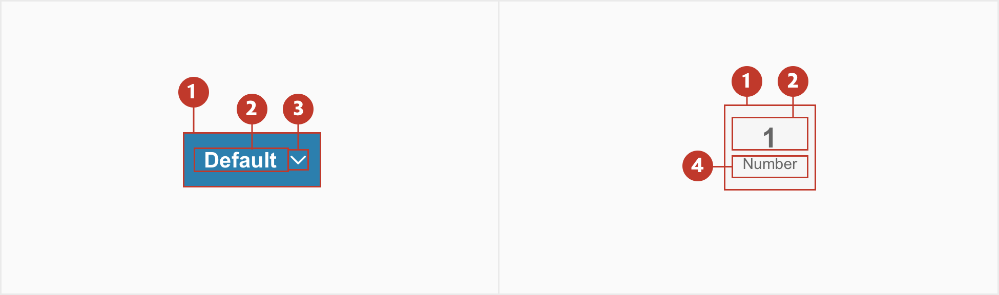

1. **Container** - Is around a text label.

2. **Main label** - Text that indicates the result of selecting the button.

3. **Icon (optional)** - Use icons after the label to draw more attention to it, or help convey more meaning.

4. **Secondary label** - Text that gives more detail about the main label.

## Variations

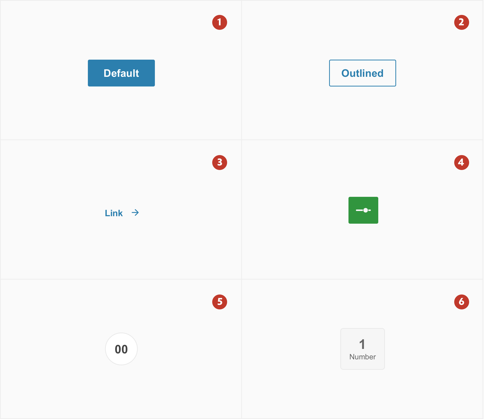

1. **Default button** - Default buttons have the highest emphasis and are used as the primary call to action on a page. Used in different places means the colour for the text and background often changes.
2. **Outlined button** - Use with a default button for actions that are less crucial such as "cancel".
3. **Link button** - Link buttons are used to navigate to another page or to be on the footer of a card to show more or less information. The icon is optional and should be used on links that redirect to another page.
4. **Icon button** - Use for actions that can be represented by an icon.
5. **Round button** - Round buttons are used to create a patternized group of actions and can have either text or an icon as a label representing the action.
6. **Square button** - Used when the main label is not enough to explain the action and needs some extra info.

## Specs

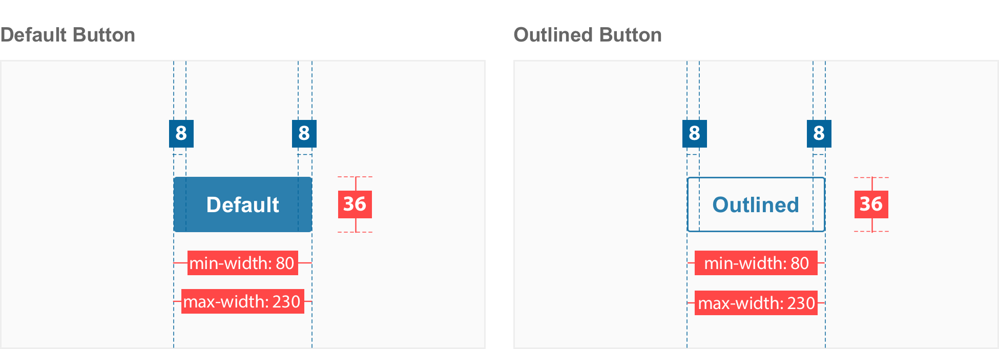

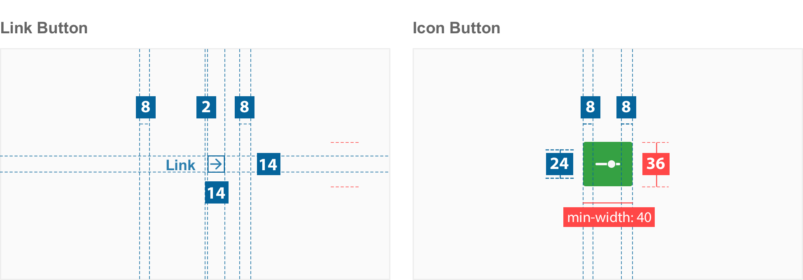

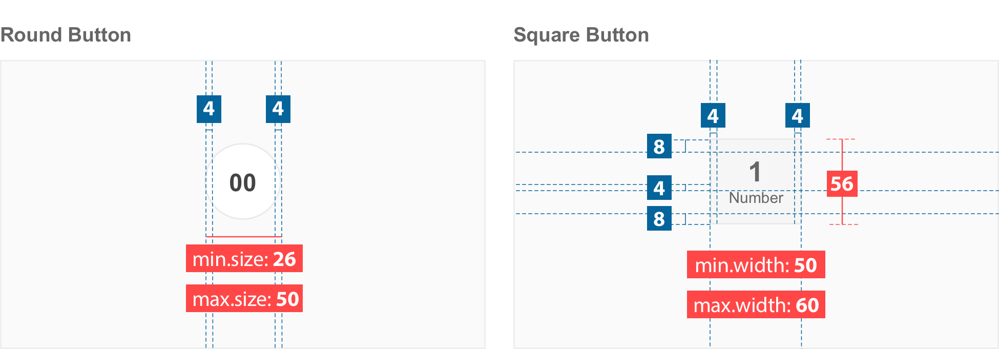

**Note:** The default, outlined, icon and detail button have `border-radius:2px`.

## Colour

### Primary button

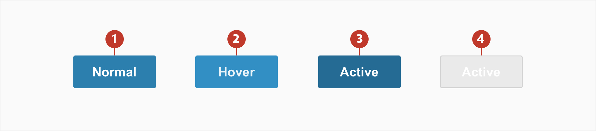

| Element | Category | Attribute                             | Value                                                               |
| ------- | -------- | ------------------------------------- | ------------------------------------------------------------------- |
| 1.      | Normal   | Background Color Text-color | $color-act-bg-primary #2c7fae \$color-white               |
| 2.      | Hover    | Background Color Text-color | \$color-act-bg-primary-pressed #328fc4 #eaf4f9            |
| 3.      | Active   | Background Color Text-color | $color-grey-900 #256b94 \$color-white                     |
| 5.      | Disable  | Background Color Text-color | \$color-act-bg-disable ​\$color-grey-200 \$color-grey-600 |

### Secondary button

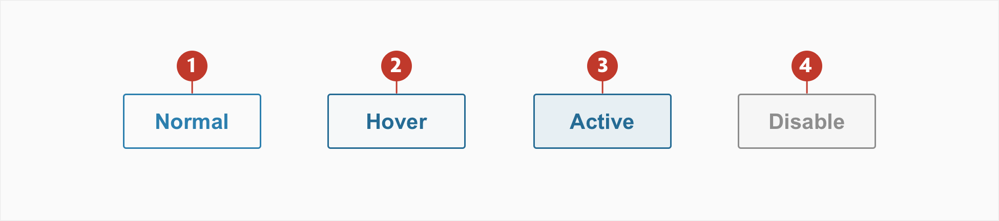

| Element | Category | Attribute                              | Value                                                       |
| ------- | -------- | -------------------------------------- | ----------------------------------------------------------- |
| 1.      | Normal   | Text-color Border                 | #2c7fae #2c7fae                                        |
| 2.      | Hover    | Background Text-color Border | \#f6f9fb \#256b94 \#256b94                        |
| 3.      | Active   | Background Text-color Border | \#e7eff3 \#256b94 \#256b94                        |
| 5.      | Disable  | Background Text-color Border | \$color-grey-50 \$color-grey-600 \$color-grey-600 |

### Round button

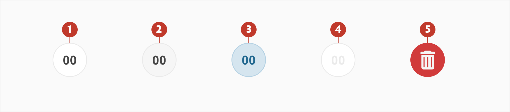

| Element | Category | Attribute                                   | Value                                                        |
| ------- | -------- | ------------------------------------------- | ------------------------------------------------------------ |
| 1.      | Normal   | Background Border Text/icon color | \$color-white ​\$color-grey-200 ​\$color-grey-900  |
| 2.      | Hover    | Background Border Text/icon color | \$color-grey-50 \$color-grey-200 ​\$color-grey-900 |
| 3.      | Active   | Background Border Text/icon color | #d5e5ef #b4d1e3 #20678F                            |
| 4.      | Disable  | Background Border Text/icon color | \$color-white \$​color-grey-200 ​\$color-grey-200  |
| 5.      | Delete   | Background Text/icon color             | \$color-red-500 \$color-white                           |

### Square button

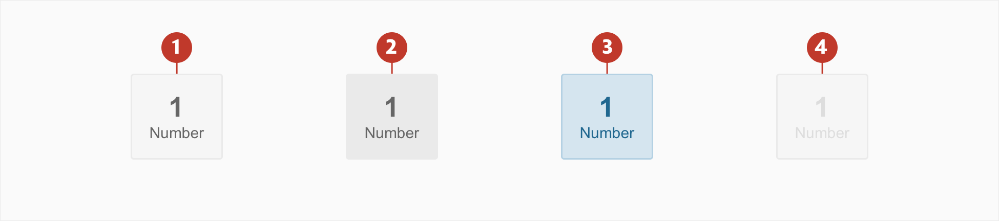

| Element | Category | Attribute                              | Value                                                          |
| ------- | -------- | -------------------------------------- | -------------------------------------------------------------- |
| 1.      | Normal   | Background Border Text-color | \$color-grey-50 \$color-grey-200 ​\$color-grey-800   |
| 2.      | Hover    | Background Border Text-color | \$color-grey-200 ​\$color-grey-200 ​\$color-grey-800 |
| 3.      | Active   | Background Border Text-color | #d5e5ef #b4d1e3 #20678F                              |
| 4.      | Disable  | Background Border Text-color | \$color-grey-50 \$color-grey-200 ​\$color-grey-300   |

## Typography

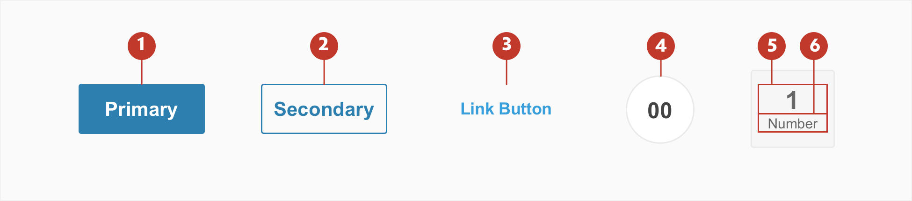

| Element | Category    | Attribute                                     | Value                                   |
| ------- | ----------- | --------------------------------------------- | --------------------------------------- |
| 1 & 2   | Medium Bold | Typeface Font Size Line height | Arial  Bold 14px 1.14    |
| 3       | Small       | Typeface Font Size Line height | Arial  Regular 12px 1.17 |
| 4       | Large Bold  | Typeface Font Size                  | Arial  Bold 16px              |
| 5       | xLarge Bold | Typeface Font Size                  | Arial  Bold 18px              |
| 6       | xSmall      | Typeface Font Size                  | Arial  Regular 10px           |

## Interaction & transition

A loading animation is used when performing when computational or connections speeds are slow. They help to notify users that loading is underway.

[button animation](./media/button_anim.mp4 ':include width=100% controls=true loop=true')
