# Card

## About Card

A card is a container for unique related data containing content and relevant actions and controls. The primary function of the card should be the action - typically to link to a new view or expand to reveal more. See card types below

Card content (e.g. images, text, icons) and quantity can vary greatly, depending on the content being expressed. Cards may be "entry points" to more complex and detailed content or "destinations" in their own right.

Card's contain actions. These actions may be accessed via icons, text or UI controls are within the context of the card.

- UI controls are used for modifying the content of the card.
- Text may contain inline links.
- Supplemental actions should have some form of visual affordance to distinguish them from other supplemental actions e.g. a line, an arrow, a UI element

One or more cards may be presented in a view. Card collections can move horizontally and/or vertically.

Cards may be controlled by UI outside of the array of cards e.g. a segmented bar or accordion.

Cards do not have a maximum height. Cards height may exceed the height of the viewport. Cards may expand to accommodate the content rather than truncate.

## Usage

Use cards to present discreet sets of content and functionality in a given view. A card is, essentially, a container for content and relevant actions. Cards are not a panacea. They don't replace the need for other UI elements like accordions, lists or buttons. Before using a card consider whether some other UI might be better. Cards are intended to serve as a UI component rather than serve a purely decorative function.

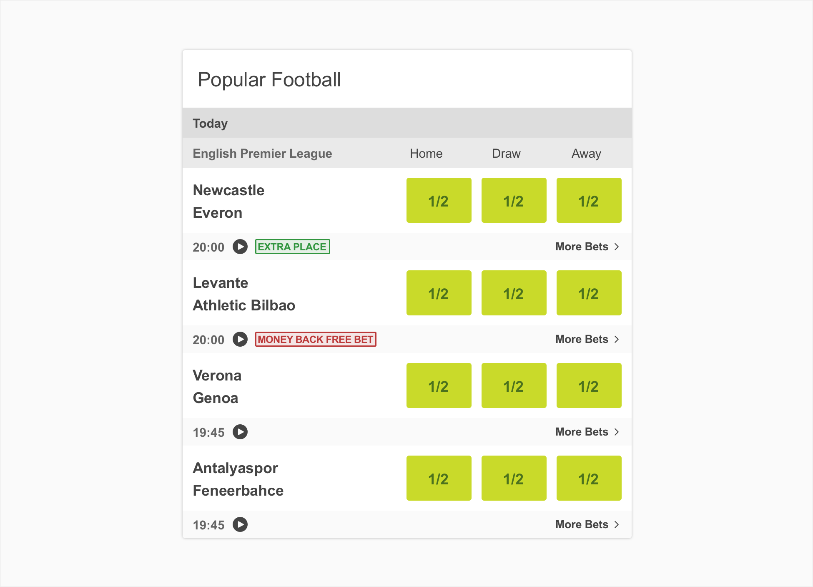

## Structure

An card comprises the following:

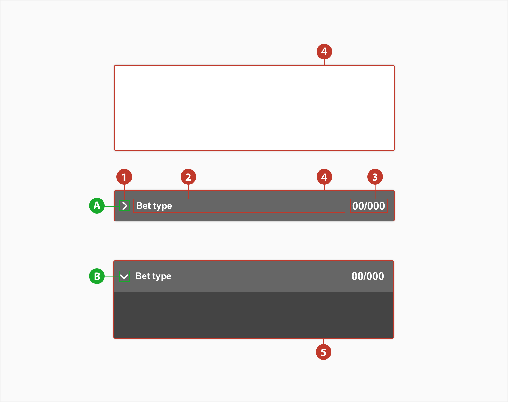

1. **Arrow** - A visual cue denoting the accordion is open **(a)** or closed **(b)**

2. **Title** - The textual title of the item. May be truncated if bigger that the % of space available.

3. **Odd** - Should be used to show the odd value.

4. **Card** - A discreet area surrounding the expanded card.

5. **Expanded card** - A discreet area surrounding the expanded card.

## Types

For standard cases like homepage or in- play , use the primary version. On the betslip we use the secondary.

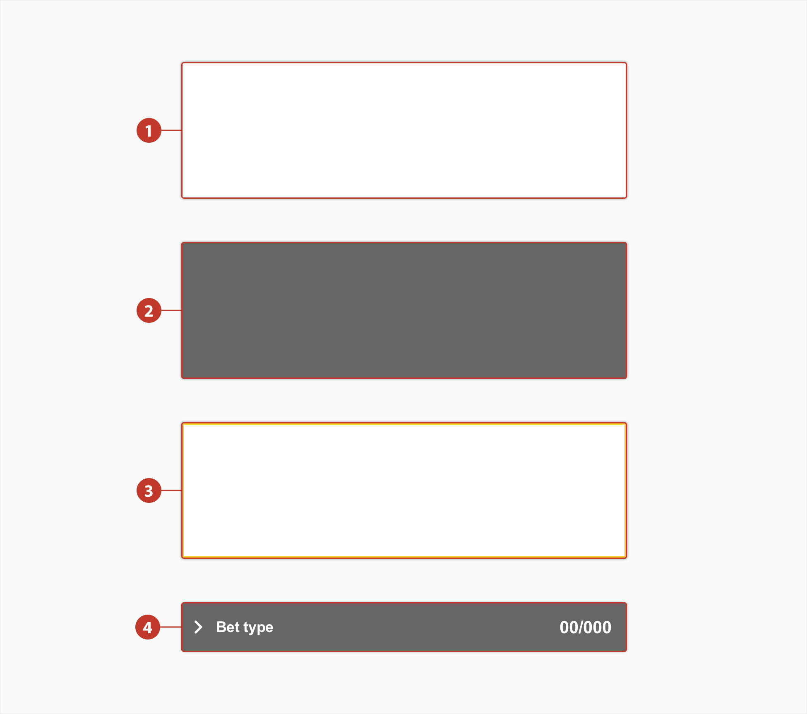

1. **Primary** - Should be the most used.

2. **Secondary** - Should be used on the betslip.

3. **Tertiary** - Should be used to hightlight a featured based content.

4. **Expanded** - Should be used on the betslip.

## Header

The header can be used to frame the section itself with a title. This is especially useful if there’s going to be multiple cards on one page

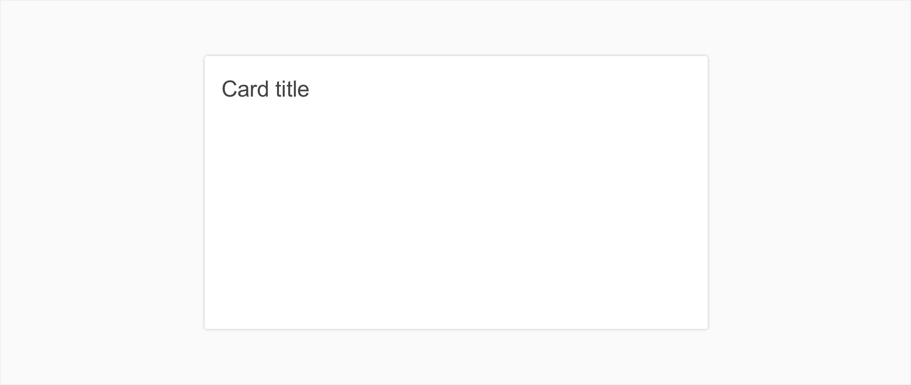

## Footer

The default footer contains links that allow the user to navigate and access additional information if and when required.

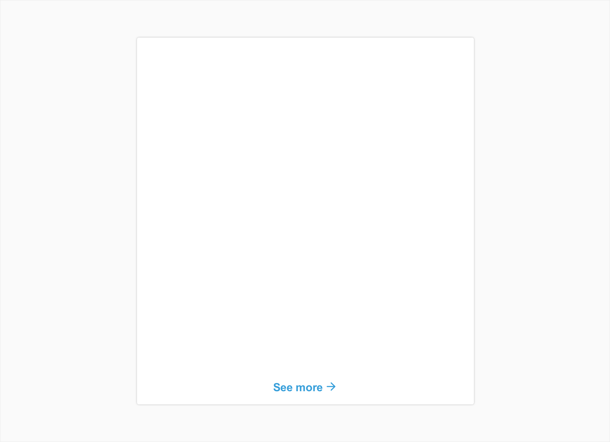

## Expand

In certain situations it’s beneficial to artificially limit the vertical height of a card to ensure a page length that’s digestible.

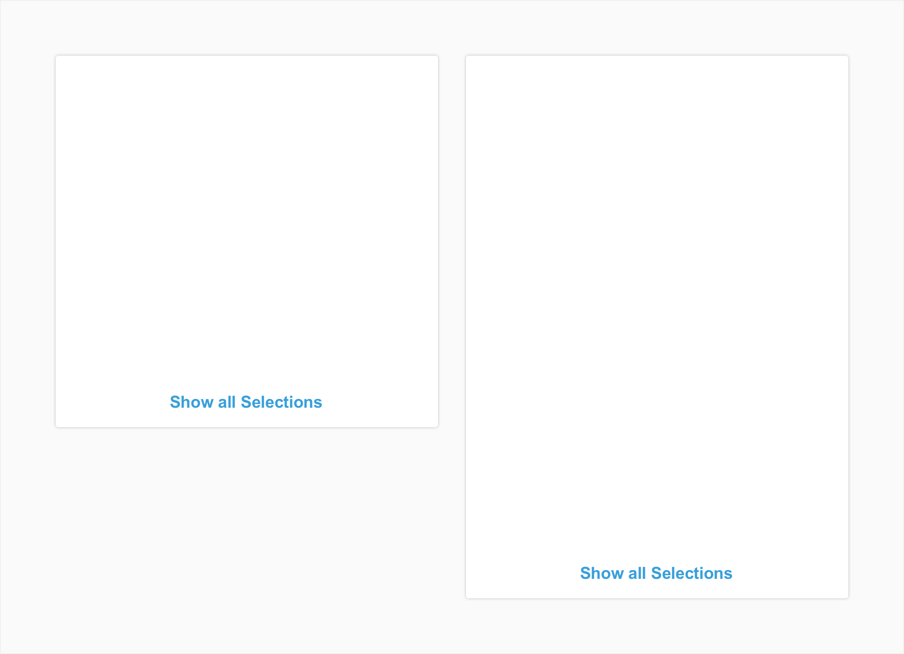

## Specs

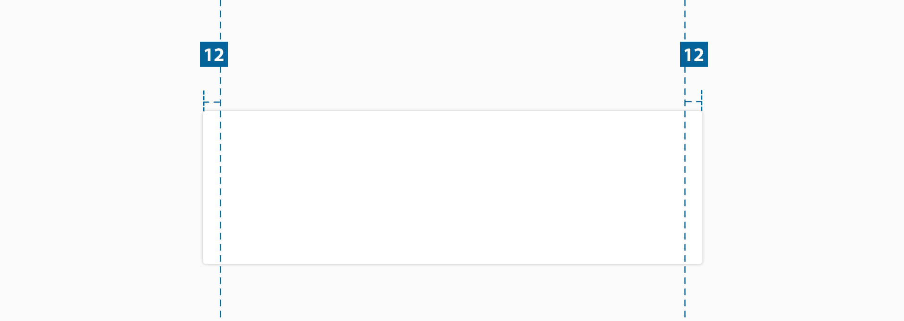

There is no limit to the height of the card, however, the padding specs above should be followed. The width of an card varies based on content, layout and page design.

**Note**: All the cards have a `border-radius:2px`

### Header

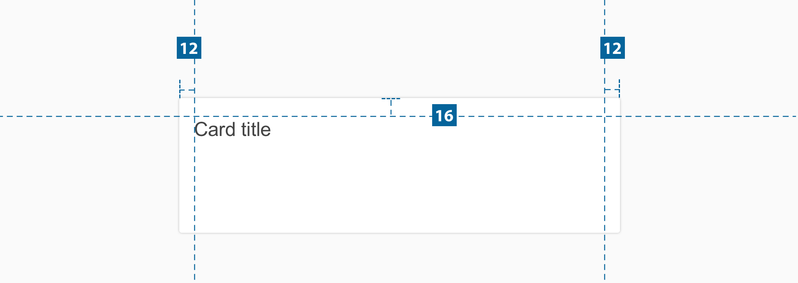

### Footer

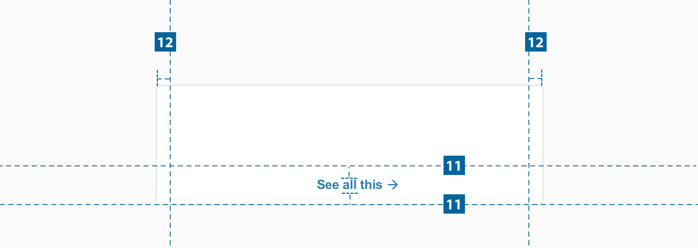

### Expanded

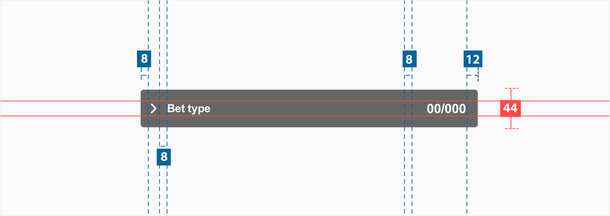

There is no limit to the height of an open row, however, the padding specs above should be
followed. The width of an expanded card varies based on the content, layout, and page design. The
chevron icon can be found on the iconography library page.

**Note:** Padding on the left is 8px because we are considering the bondery box on the arrow
icon.

## Colour

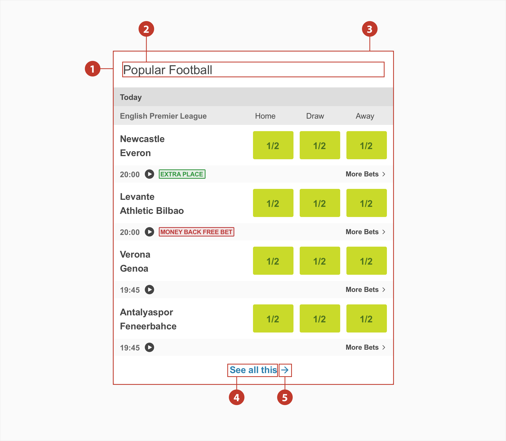

| Element | Category            | Attribute                     | Value                                         |
| ------- | ------------------- | ----------------------------- | --------------------------------------------- |
| 1.      | Background          | Token Color Opacity | \$color-white #ffffff 100%          |
| 2.      | Title               | Token Color Opacity | \$color-grey-800 #444444 100%       |
| 3.      | Shadow              | Color Size               | rgba(0,0,0,0.25); 0px 0px 2px 0px        |
| 4. & 5. | Link & Icon         | Token Color Opacity | \$color-link-txt #2C7FAE 100%       |
| 4. & 5  | Link & Icon : Hover | Token Color Opacity | \$color-link-txt-hover #256B94 100% |

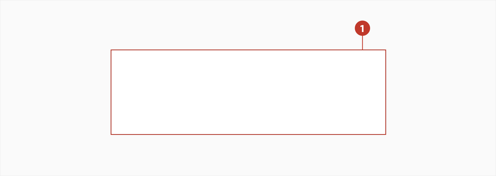

| Element | Category   | Attribute                     | Value                                |
| ------- | ---------- | ----------------------------- | ------------------------------------ |
| 1.      | Background | Token Color Opacity | \$color-white #ffffff 100% |

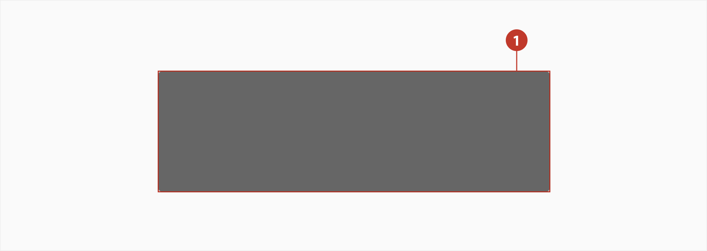

| Element | Category         | Attribute                     | Value                                   |
| ------- | ---------------- | ----------------------------- | --------------------------------------- |
| 1.      | Background       | Token Color Opacity | \$color-grey-800 #666666 100% |
|         | Background-hover | Token Color Opacity | \$color-grey-900 #444444 100% |

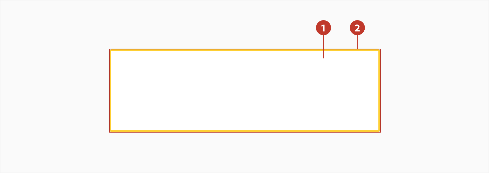

| Element | Category   | Attribute                     | Value                                     |
| ------- | ---------- | ----------------------------- | ----------------------------------------- |
| 1.      | Background | Token Color Opacity | \$color-white #ffffff 100%      |
| 2.      | Border     | Token Color Opacity | \$color-yellow-400 #fecf33 100% |

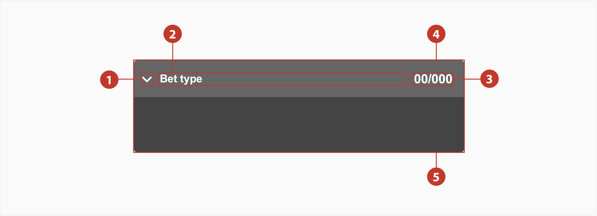

| Element | Category            | Attribute                     | Value                                         |
| ------- | ------------------- | ----------------------------- | --------------------------------------------- |
| 1. & 2. | Icon & Label        | Token Color Opacity | \$color-white #ffffff 100%          |
| 3.      | Title               | Token Color Opacity | \$color-white #ffffff 100%          |
| 4.      | Background          | Token Color Opacity | \$color-grey-800 #666666 100%       |
| 5.      | Background-expand   | Token Color Opacity | \$color-grey-900 #444444 100%       |
|         | Link & Icon : Hover | Token Color Opacity | \$color-link-txt-hover #256B94 100% |
| 6.      | Border              | Border-radius                 | 2px                                           |

## Typography

| Element | Category    | Attribute                                     | Value                                 |
| ------- | ----------- | --------------------------------------------- | ------------------------------------- |
| Title   | Medium Bold | Typeface Font Size Line height | Arial Bold 12px 1.17   |
| Label   | Small       | Typeface Font Size Line height | Arial Regular 10px 1.2 |

## Interaction & transition

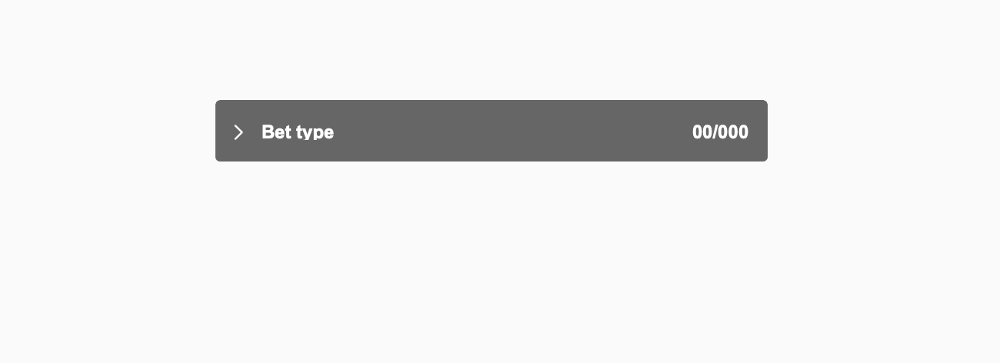
