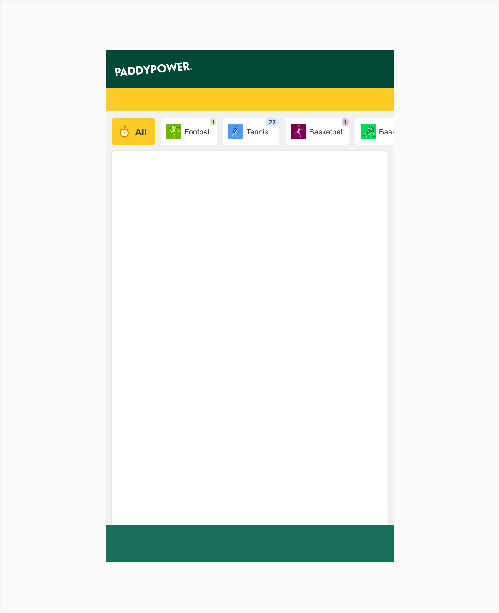
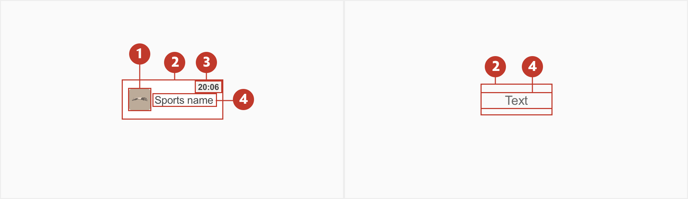
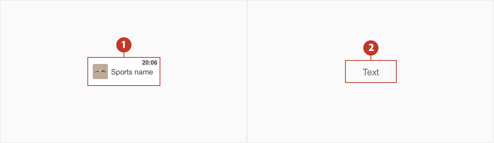
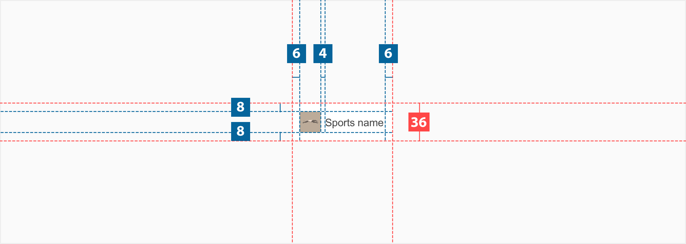
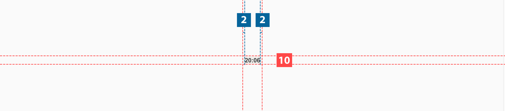
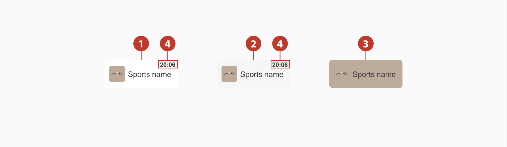
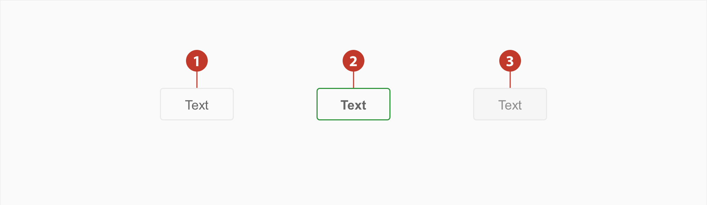
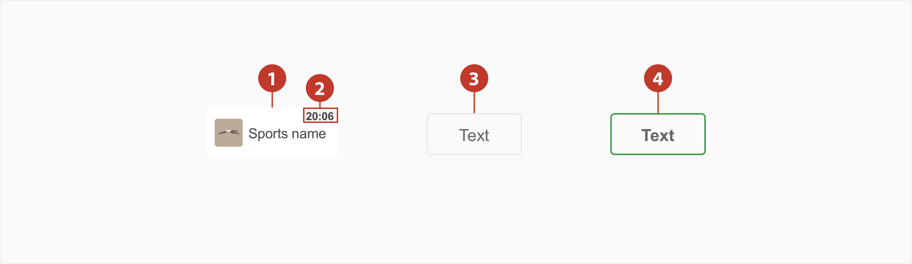

# Chips

## About Chips

Chips allow our users to make selection or filter content. Unlike buttons, this should be treated only to filter/treat information rather than providing a destination.

## Usage

### How to Use

- They should be compact, be careful of the content inside of them need to be clear.

- They need to be relevant and have a clear relationship to the content they represent.

- Chips should make the task to sort content easier.

### How Not to Use

They are not a button, so this should no be used to go to locations

## Structure

A tab comprises the following:

1. **Icon** - An area where you can add one icons.
2. **Background** - A discreet area surrounding the chip.
3. **Label** - This text label could be a counter or countdown.
4. **Title** - The textual label of the item. May be truncated if bigger than the % of space available.

## Types

For standard cases like the in- play or virtuals, use the primary version.

1. **Primary** - Should be the most used.
2. **Secondary** - Should be used on horse racing or greyounds next races.

## Specs

### Primary

When using the primary with counter, a `padding-right: 2px` and `padding-radius:2px` needs to be added from the edge of the background

### Secondary

## Colour

### Primary

| Element | State  | Category   | Attribute                           | Value                                    |
| ------- | ------ | ---------- | ----------------------------------- | ---------------------------------------- |
| 1.      | Normal | Background | Color Text-colour              | $color-white \$color-grey-800       |
| 2.      | Hover  | Background | Color Text-colour              | $color-grey-150 \$color-grey-800    |
| 3.      | Active | Background | Color Text-colour              | $color(…) \$color-grey-800          |
| 4.      | Normal | Counter    | Text-colour Color Opacity | $color-grey-600 \$color(…) 15% |
| 4.      | Hover  | Counter    | Text-colour Color Opacity | $color-grey-600 \$color(…) 15% |

### Secondary

| Element | State  | Category   | Attribute              | Value                                 |
| ------- | ------ | ---------- | ---------------------- | ------------------------------------- |
| 1.      | Normal | Border     | Color Border      | \$color-grey-550 1px             |
| 2.      | Active | Background | Color Border      | \$color-esmerald-300 1px         |
| 2.      | Active | Background | Text-colour            | \$color-grey-550                      |
| 3.      | Hover  | Background | Color Text-colour | $color-grey-150 \$color-grey-500 |
| 5.      | Hover  | Border     | Color Border      | \$color-grey-300 1px             |

## Typography

| Element | Category | Attribute                                     | Value                                  |
| ------- | -------- | --------------------------------------------- | -------------------------------------- |
| 1.      | Small    | Typeface Font Size Line height | Arial Regular 10px 1.2  |
| 2.      | xSmall   | Typeface Font Size Line height | Arial Regular 8px 1.25  |
| 3.      | Medium   | Typeface Font Size Line height | Arial Regular 12px 1.17 |
| 4.      | Medium   | Typeface Font Size Line height | Arial Bold 12px 1.17    |
