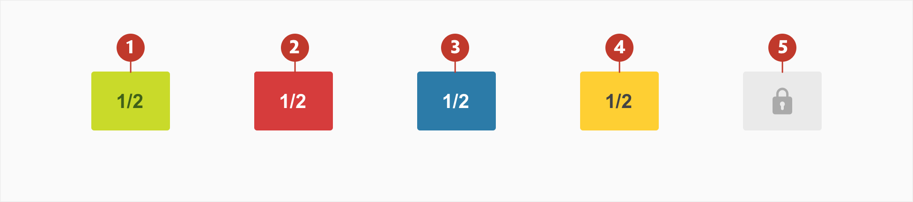
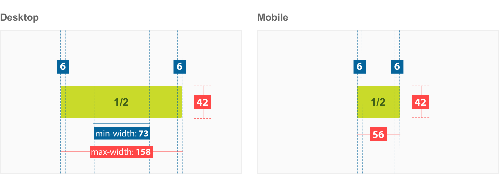
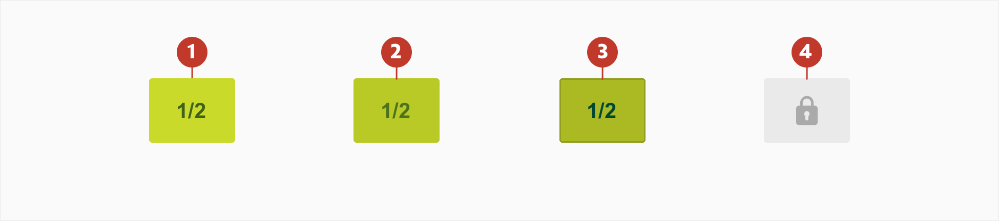
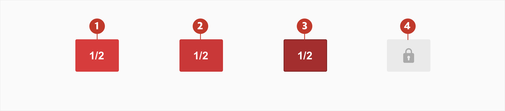
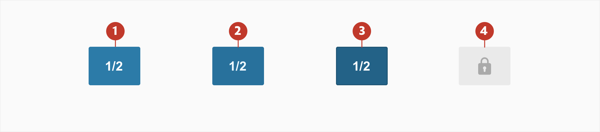
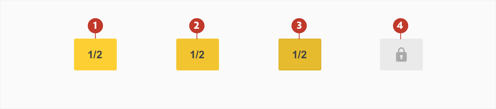
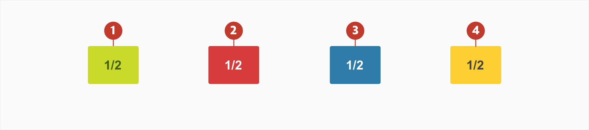

# Bet Button

## About Bet button

Bet buttons allow users to place a bet. They are the starting point for making a selection and when clicked add a desired selection to the betslip.

A button contains a numeric label representing the odds. The odds are expressed as a pair of numbers as fractions (e.g. 4/1) or a single number as decimals (e.g. 5.0) depending on the users preference.

## Usage

Bet buttons communicate the price of anything that can be bet on. They are used to tell users the odds associated with a selection in any given match/game/event and act as the primary call to action for bet placement.

## Structure

Bet Buttons are composed of two elements:

1. **Container** - space around the label.
2. **Numeric Label** - the odds which describe the ratio of pay-out to stake

## Types

1. **Bet Button** - default state of odds for any selection
2. **Bet Button Price Up** - use when the odds for a selection increase
3. **Bet Button Price Down** - use when the odds for a selection decrease
4. **Bet Button PowerPrice** - use to signify increased value for a selection
5. **Bet Button Disabled** - use to indicate a suspended or discontinued selection

## Specs

## Colour

### Bet Button

| Element | Category | Attribute                                           | Value                                                              |
| ------- | -------- | --------------------------------------------------- | ------------------------------------------------------------------ |
| 1.      | Normal   | Background Colour Text-colour             | \$color-act-bg-odds #c9da2a #406118                      |
| 2.      | Hover    | Background Colour Text-colour             | \$color-act-bg-odds-hover #b9c926 #4c721d                |
| 3.      | Active   | Background Colour Text-colour Border | \$color-act-bg-odds-pressed #abba23 #004833 #919e1e |
| 4.      | Disable  | Background Colour Icon Colour             | \$color-act-bg-disable #eaeaea #aaaaaa                   |

### Bet Button Price Up

| Element | Category | Attribute                                           | Value                                                                |
| ------- | -------- | --------------------------------------------------- | -------------------------------------------------------------------- |
| 1.      | Normal   | Background Colour Text-colour             | \$color-act-bg-oddsup #d63c3c #ffffff                      |
| 2.      | Hover    | Background Colour Text-colour             | \$color-act-bg-oddsup-hover #c93838 #fff0f0                |
| 3.      | Active   | Background Colour Text-colour Border | \$color-act-bg-oddsup-pressed #a32e2e #ffffff #802424 |
| 4.      | Disable  | Background Colour Icon Colour             | \$color-act-bg-disable #eaeaea #aaaaaa                     |

### Bet Button Price Down

| Element | Category | Attribute                                           | Value                                                                  |
| ------- | -------- | --------------------------------------------------- | ---------------------------------------------------------------------- |
| 1.      | Normal   | Background Colour Text-colour             | \$color-act-bg-oddsdown #2c7ba8 #ffffff                      |
| 2.      | Hover    | Background Colour Text-colour             | \$color-act-bg-oddsdown-hover #28719c #ecf8ff                |
| 3.      | Active   | Background Colour Text-colour Border | \$color-act-bg-oddsdown-pressed #236287 #ffffff #1e5473 |
| 4.      | Disable  | Background Colour Icon Colour             | \$color-act-bg-disable #eaeaea #aaaaaa                       |

### Bet Button PowerPrice

| Element | Category | Attribute                                           | Value                                                                    |
| ------- | -------- | --------------------------------------------------- | ------------------------------------------------------------------------ |
| 1.      | Normal   | Background Colour Text-colour             | \$color-act-bg-powerprice #fecf33 #444444                      |
| 2.      | Hover    | Background Colour Text-colour             | \$color-act-bg-powerprice-hover #f2c530 #444444                |
| 3.      | Active   | Background Colour Text-colour Border | \$color-act-bg-powerprice-pressed #e6bb2e #444444 #d9b02b |
| 4.      | Disable  | Background Colour Icon Colour             | \$color-act-bg-disable #eaeaea #aaaaaa                         |

## Typography

| Element     | Category | Attribute                                     | Value                                |
| ----------- | -------- | --------------------------------------------- | ------------------------------------ |
| 1, 2, 3 & 4 | Large    | Typeface Font Size Line height | Arial  Bold 14px 1.14 |

## Interaction & transition

When the odds increase or decrease an animation indicates a change in odds and button style. The button changes from **Bet Button** to **Bet Button Price Up** or **Bet Button Price Down**. This signifier is used to notify users of changes. After 4 seconds it fades out and rolls back to the normal bet button colour.

[button animation](media/button_anim.mp4 ':include width=100% controls=true loop=true')
