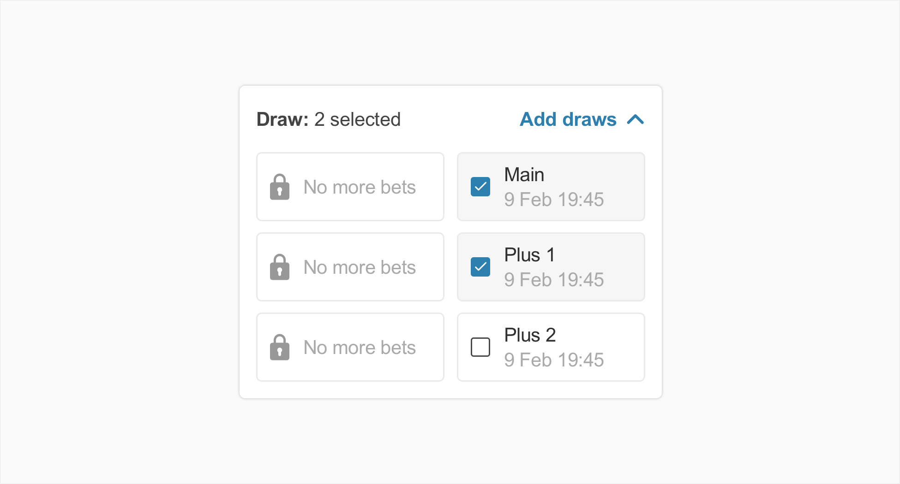
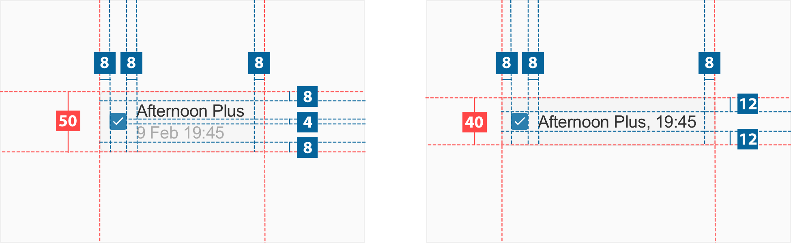
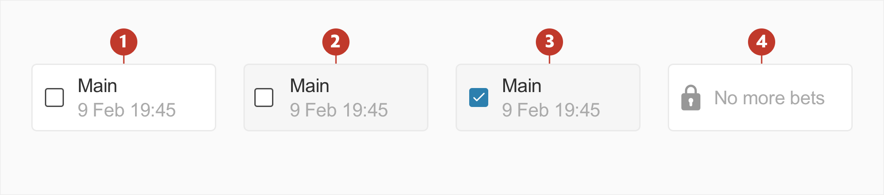

# Option Selector

## About Option Selector

An option selector allows the user to select one or multiple options from a predifined list.

## Usage

## Structure

An option selector consists of the following:

2. **Simple selection component** - simple selection component like the checkbox or radio button.
3. **Container** - area bounding the icon and labels.
4. **Main text** - text description of selection.
5. **Secondary text (optional)**

## Specs

## Colour

| Element | Category | Attribute                                                 | Value                                                                              |
| ------- | -------- | --------------------------------------------------------- | ---------------------------------------------------------------------------------- |
| 1.      | Normal   | Background Border Main text Secondary text | \$color-white \$​color-grey-200 \$colour-grey-925 \$color-grey-500  |
| 2.      | Hover    | Background Border Main text Secondary text | \$color-grei-50 \$color-grey-200 \$colour-grey-925 \$color-grey-500 |
| 3.      | Active   | Background Border Main text Secondary text | \$color-grei-50 \$color-grey-200 \$colour-grey-925 \$color-grey-500 |
| 4.      | Disabled | Background Border Text Icon                | \$color-white \$color-grey-200 \$color-grey-500 \$color-grey-500    |

## Typography

| Element | Category | Attribute                    | Value                         |
| ------- | -------- | ---------------------------- | ----------------------------- |
| 1.      | Medium   | Typeface Font Size | Arial  Regular 14px |
