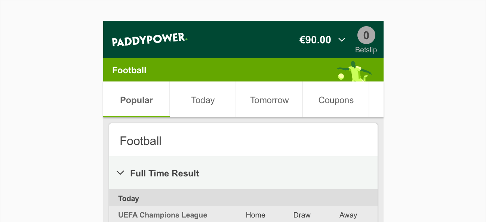
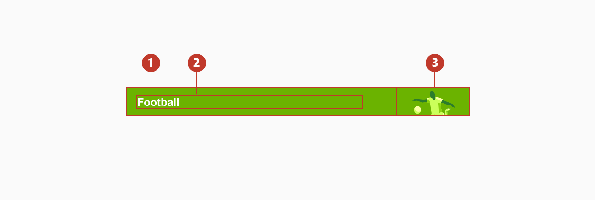
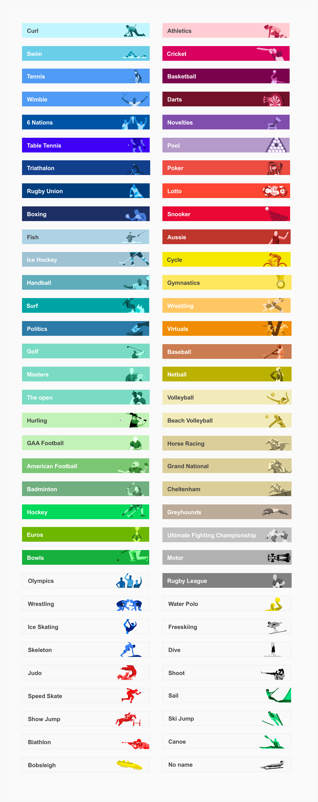
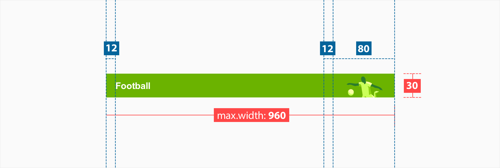
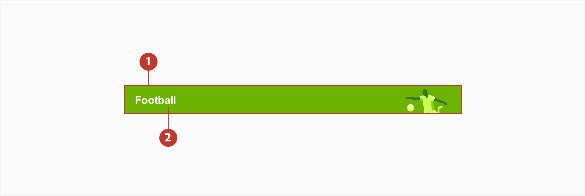

# Page header

## About page headers

The page header is a pattern that helps define the uppermost part a webpage or product. It is the first section that people see before scrolling and provides the core information that users need to identify what page they are on.

## Usage

A Page Header is only used for branding and page titles. It should be used to quickly understand what the current page is.

## Structure

1. **Container** - Surrounds a text label.

2. **Main label** - This refers to the title of the page. Each page has its own unique title.

3. **Icon** - The icon is always related to the page.

## Variations

The page header has many variations, with some variable including the text, background and icon.

## Specs

## Colour

| Element | Category        | Attribute                     | Value                                                             |
| ------- | --------------- | ----------------------------- | ----------------------------------------------------------------- |
| 1.      | Background      | Token Color Opacity | \$color-sp-football-primary #6eb700 100%                |
| 2.      | Text (variable) | Token Color Opacity | \$color-grey-900 or Color-white #444444 or #ffffff 100% |

## Typography

| Element | Category    | Attribute                                     | Value                                |
| ------- | ----------- | --------------------------------------------- | ------------------------------------ |
| Title   | Medium Bold | Typeface Font Size Line height | Arial  Bold 12px 1.17 |
