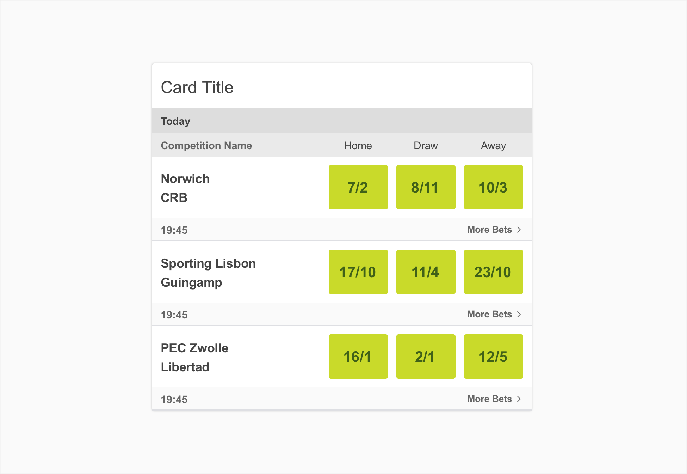
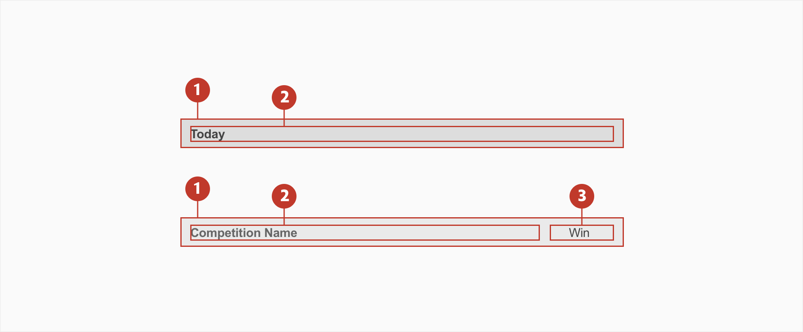
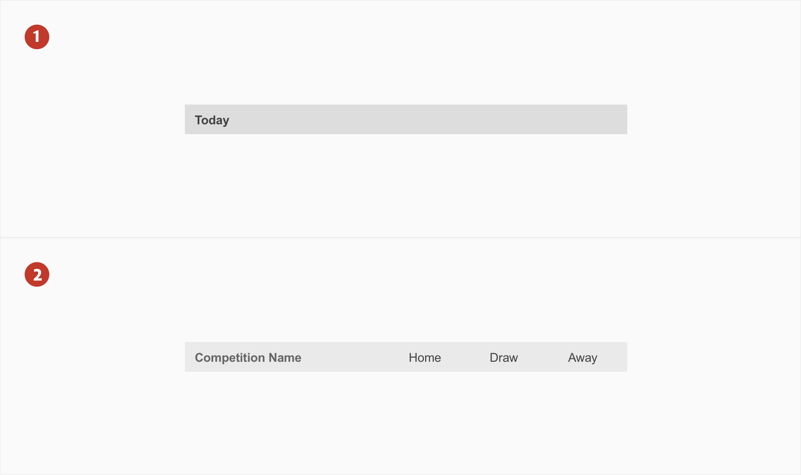
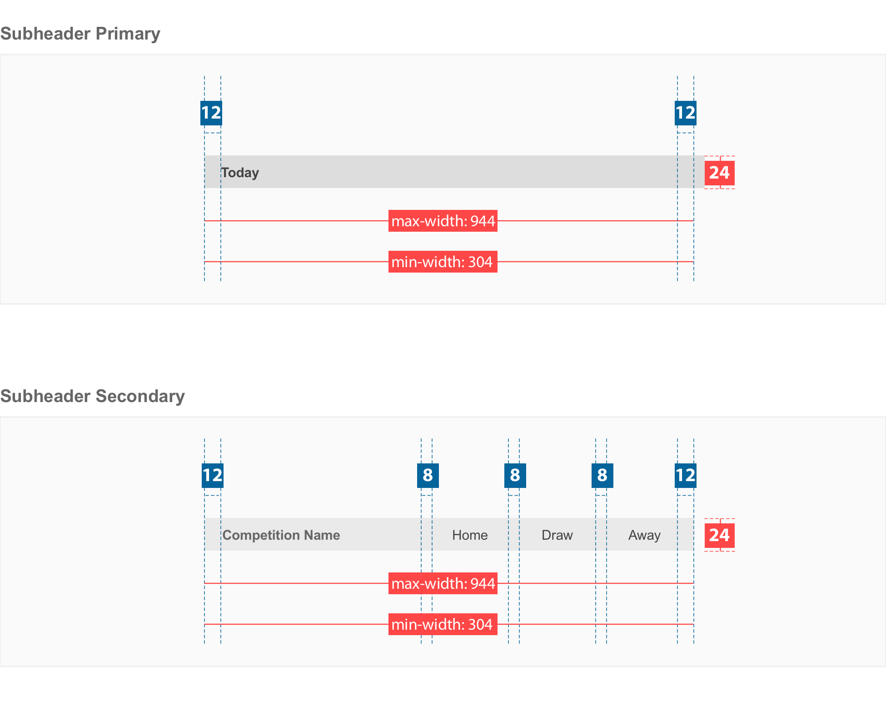
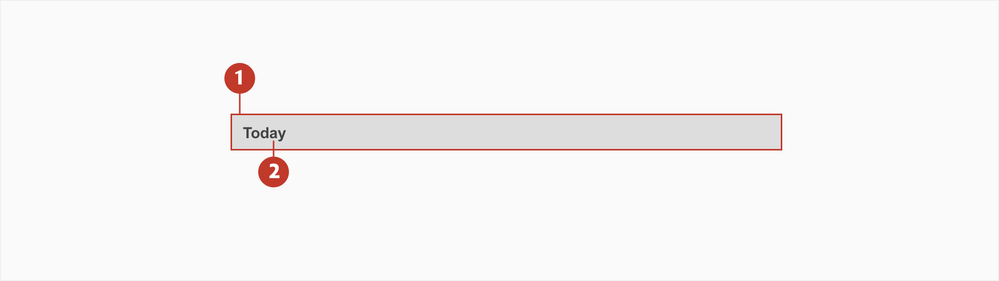
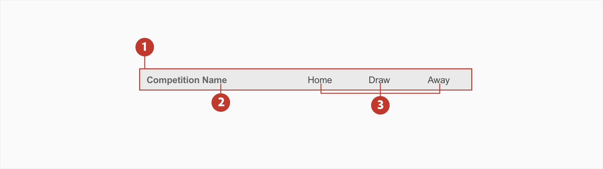

# Subheader

## About subheader

A subheader is a secondary header that defines or separates sections containing related data. Subheaders are normally used to separate different sections in cards.

There are two types of subheaders: **Subheader Primary** and **Subheader Secondary**.

## Usage

Use subheader to separate subsections in cards to define or separates sections containing related data.

## Structure

It should be used in cards, giving a clear understanding to what is beeing displayed in the different sections.

1. **Container** - Is around a text label.
2. **Main label** - This refers to the title of the subheader.
3. **Secondary label** - This refers to the secondary label of the subheader

## Types

There are two main subheader types:

**Subheader primary** have higher emphasis and are used as the primary subheaders to separate larger sections in cards. (Type 1)
**Subheader secondary** normally give name to the sub sections such as competition or market. (Type 2)

1. **Subheader primary** - Subheader primary have higher emphasis and are used as the primary subheaders to separate larger sections in cards.(ex:Today, Tomorrow, Monday)826959
2. **Subheader secondary** - subheader secondary with main label and three secondary labels. Subheader Secondary can have one or more secondary labels.

## Specs

## Colour

### Subheader Primary

| Element | Category          | Attribute                     | Value                                   |
| ------- | ----------------- | ----------------------------- | --------------------------------------- |
| 1.      | Background        | Token Color Opacity | \$color-grey-300 #dddddd 100% |
| 2.      | Text (main label) | Token Color Opacity | \$Color-grey-900 #444444 100% |

###

### Subheader Secondary

| Element | Category               | Attribute                     | Value                                   |
| ------- | ---------------------- | ----------------------------- | --------------------------------------- |
| 1.      | Background             | Token Color Opacity | \$color-grey-200 #eaeaea 100% |
| 2.      | Text (main label)      | Token Color Opacity | \$color-grey-800 #666666 100% |
| 3.      | Text (secondary label) | Token Color Opacity | \$color-grey-900 #444444 100% |

## Typography

| Element      | Category    | Attribute                                     | Value                                |
| ------------ | ----------- | --------------------------------------------- | ------------------------------------ |
| 1.Main label | xSmall Bold | Typeface Font Size Line height | Arial  Bold 10px -0.1 |

| Element           | Category    | Attribute                                     | Value                                   |
| ----------------- | ----------- | --------------------------------------------- | --------------------------------------- |
| 1.Main Label      | xSmall Bold | Typeface Font Size Line height | Arial  Bold 10px -0.1    |
| 3.Secondary label | xSmall      | Typeface Font Size Line height | Arial  Regular 10px -0.1 |
