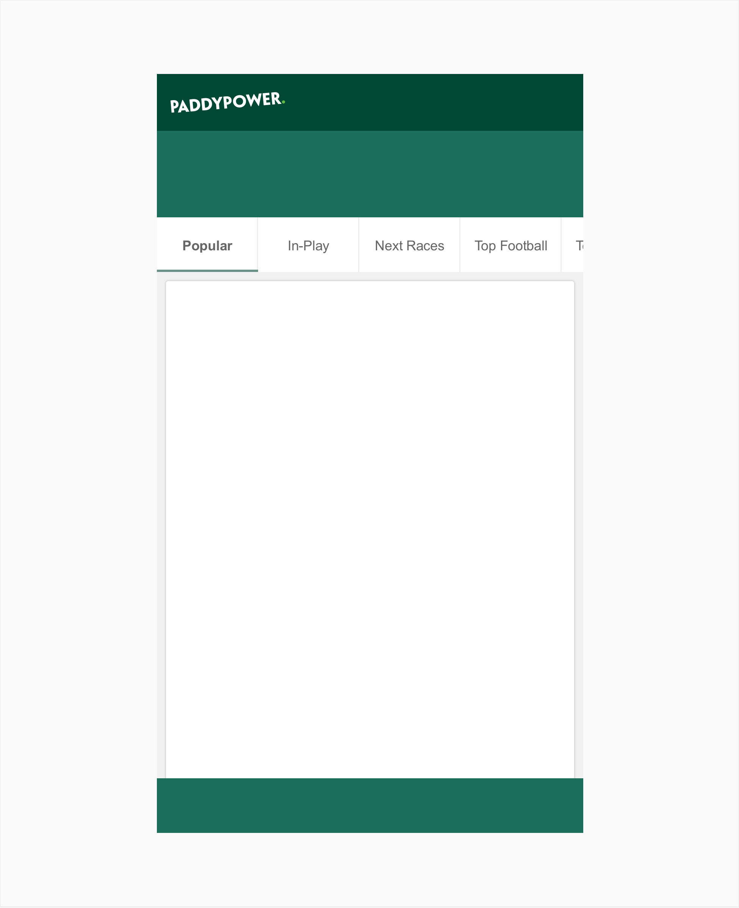
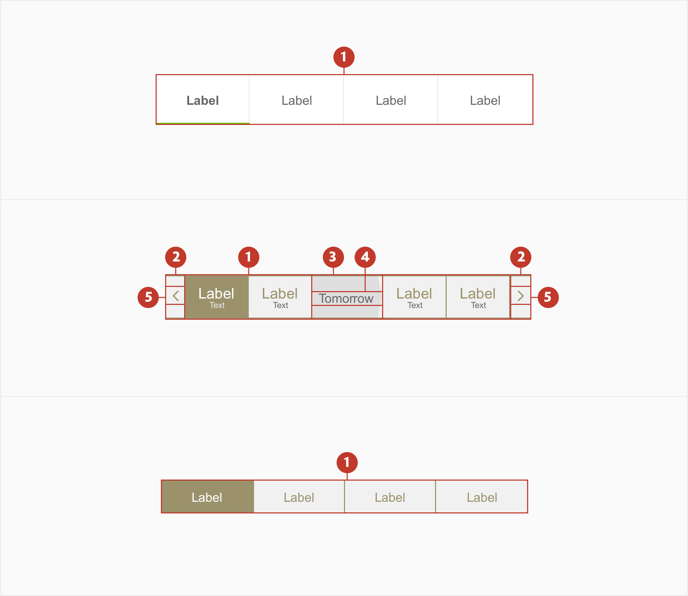
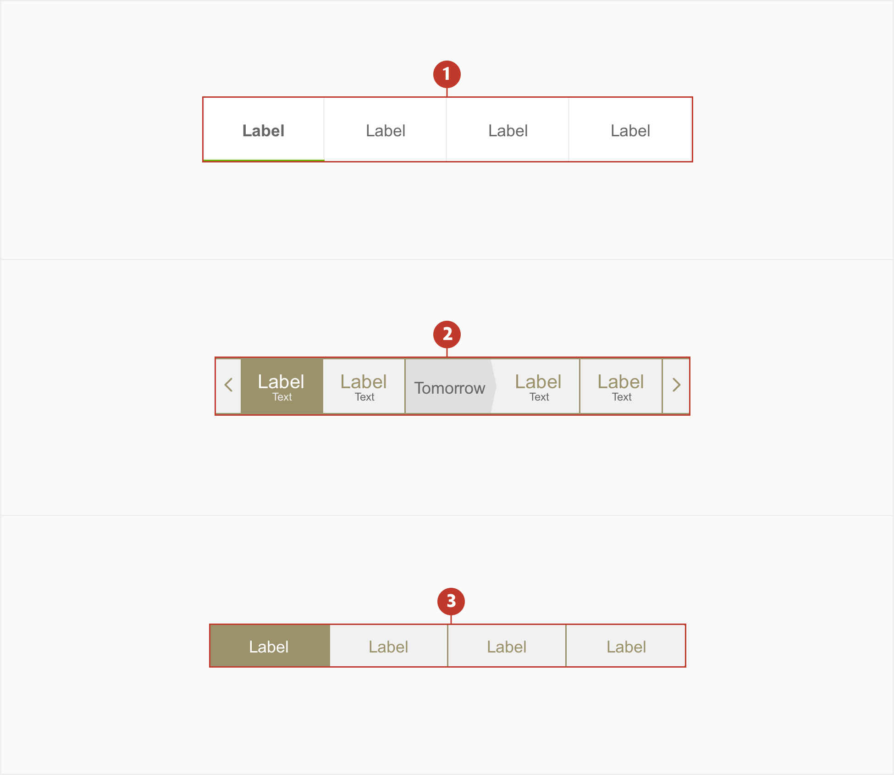
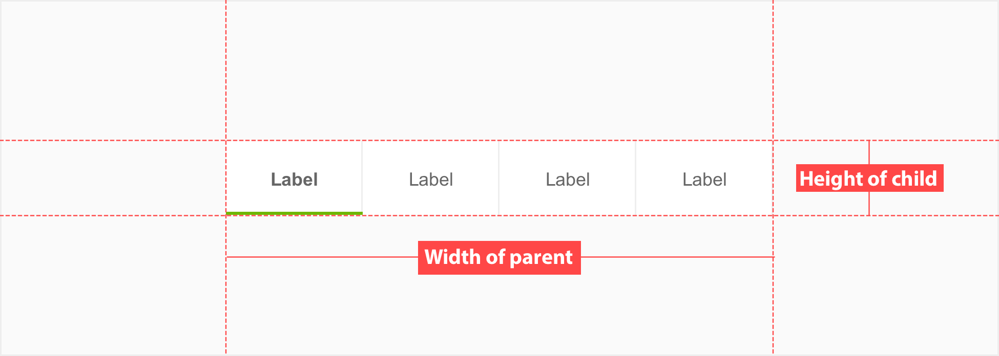
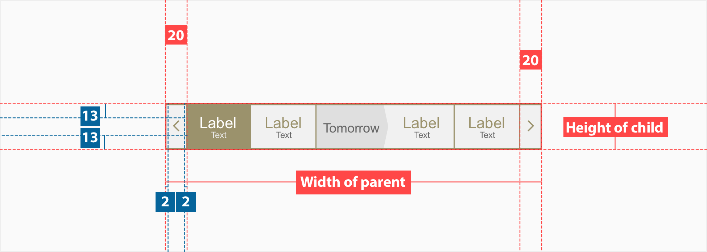
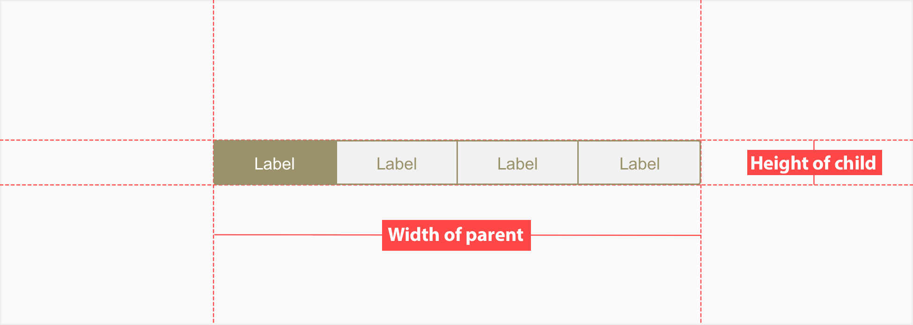
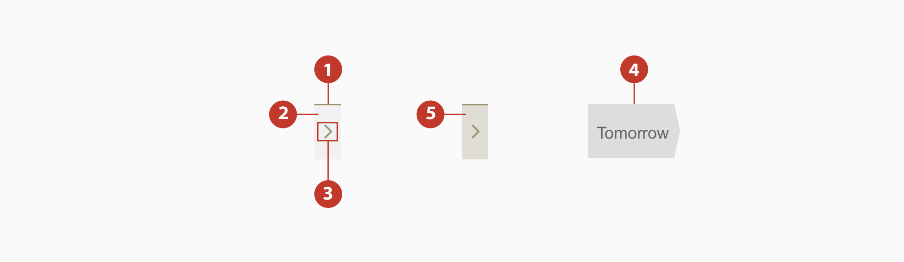
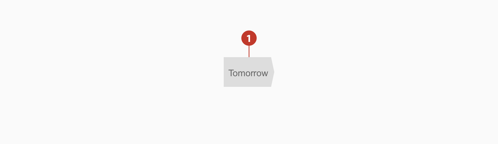
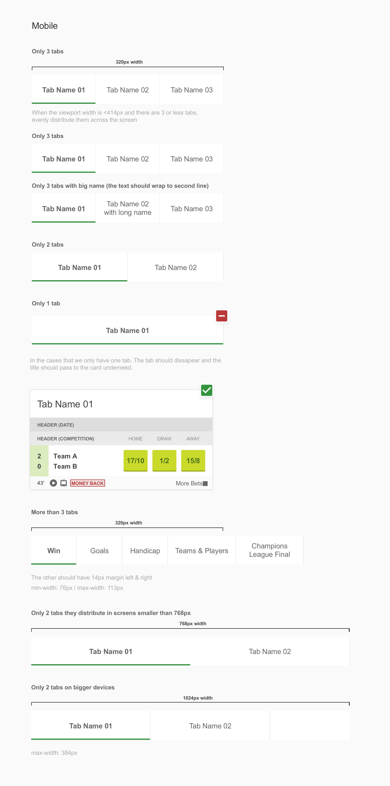

# Tabs

## About tabs

Tabs orghanise a single web-pages content into categories. They allow users to quickly switch between related information without having to refresh the page.

## Usage

Use tabs for navigating content on a single page and to group content into seperate sections. Tab "buttons" should not be used to perform actions. If you need to provide controls that act on elements in the current view, use a toolbar instead.

## Structure

Tabs comprise of the following:

1. **Shell** - Container to group tabs.
2. **Arrows** - Controls to cycle trough the tab list.
3. **Background** - A discreet area surrounding the expanded tab.
4. **Title** - The textual label of the item. May be truncated if bigger than the % of space available.
5. **Icon** - Visual element used to signify next or back. Used if there is not enough space for options on tabs for desktop.

## Types

1. **Default** - Should be used as primary local navigation for any destination.
2. **Secondary** - Should be used for horse racing or greyounds ribbon.
3. **Tertiary** - Should be used for horse racing or greyounds racecards.

## Specs

### Primary

### Secondary

When using secondary tabs, a `border-bottom: 1px` needs to be added on the bottom.

### Tertiary

## Colour

### Secondary

| Element | State  | Category   | Attribute              | Value                                         |
| ------- | ------ | ---------- | ---------------------- | --------------------------------------------- |
| 1.      | Normal | Border     | Color Border      | \$color-sp-horseracing-secondary 1px     |
| 2.      | Normal | Background | Color                  | \$color-grey-100                              |
| 3.      | Next   | Icon       | Color Text-colour | \$color-sp-horseracing-secondary #ffffff |
| 4.      | Normal | Background | Color Text-colour | \$color-grey-300 #66666                  |
| 5.      | Hover  | Background | Color Opacity     | \$color-sp-horseracing-secondary 25%     |

## Typography

| Element | Category | Attribute                                     | Value                                  |
| ------- | -------- | --------------------------------------------- | -------------------------------------- |
| 1.      | Small    | Typeface Font Size Line height | Arial Regular 12px 1.17 |

## Behaviour

### Primary

