# Tab

## About tab

A tab is a single-line array of links formatted as “tabs”.

Tabs are used as the highest level of navigation on a single page to provide access between equivalent types of information that are closely related and mutually exclusive.

## Usage

When you need to provide access to between 1 and 7 items at the same level in the information hierarchy.

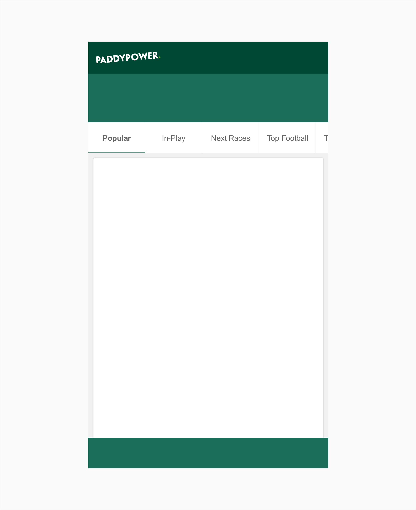

### How to Use

- Use consistent labels to name the tabs.
- The tab menu presents one of the tabs _selected by default_. The selected tab should be the first one in the list, coinciding with the tab the user is more likely to need or access most often.
- Use no more tabs than fit on the screen width. If there are more options than can fit consider using _carousel tabs._
- Tabs do not need to be the same width but the title must be readable.

### How Not to Use

Do not use icons or images alone to form the tab array. Always include a text label at a minimum.

## Structure

A tab comprises the following:

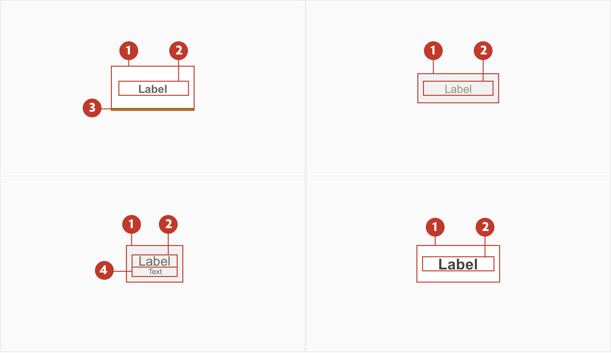

1. **Background** - A discreet area surrounding the expanded tab.
2. **Title** - The textual label of the item. May be truncated if bigger than the % of space available.
3. **Accent line** - Used to show active tab.
4. **Sub-title** - Secondary information. May be truncated if bigger than the % of space available.

**Note**: All the tab's when working together have a physical separator either as a line or spacing (more to be specified on the specs chapter).

## Types

For standard cases like the homepage or in- play, use the primary version. On the betslip use the secondary.

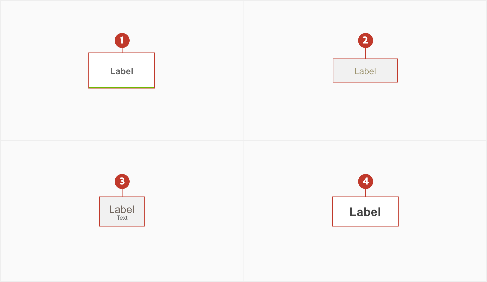

1. **Default** - Should be the most used.
2. **Secondary** - Should be used on horse racing or greyounds ribbon.
3. **Tertiary** - Should be used on horse racing or greyounds racecards.
4. **Embedded** - Should be used on lotteries gameplay.

## Specs

### Primary

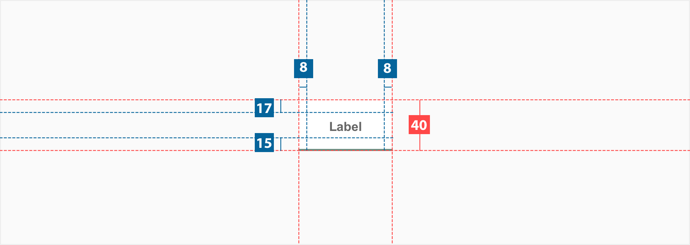

When using the primary tab's grouped, a `border-right: 1px` needs to be added.

### Secondary

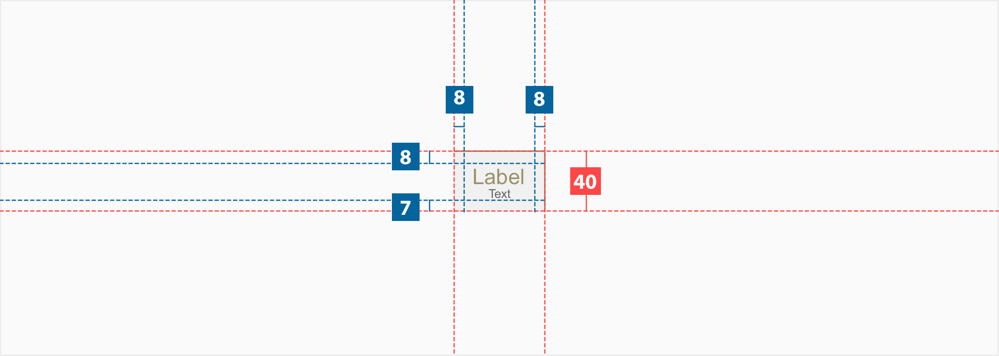

When using the Strip-secondary tab's grouped, a `border-right: 1px` and `border-radius:2px` needs to be added on the top and bottom corner of the respective side of the outside tab.

### Terciary

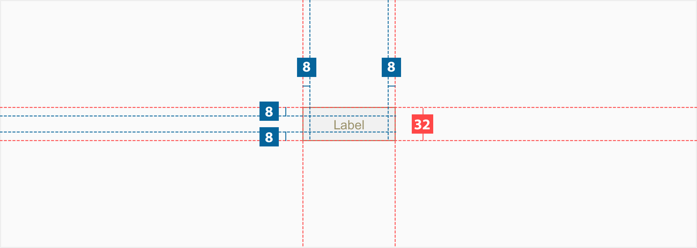

When using the Strip-tertiary tab's grouped, a `border-right: 1px` needs to be added.

### Embedded

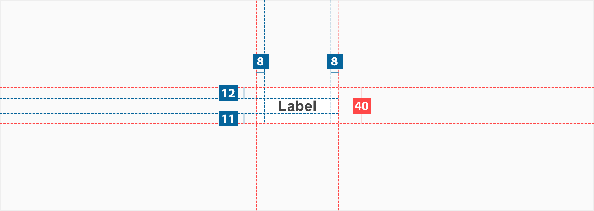

This type of tab is always used on top of a card and edge to edge. When using the embedded tabs, a `border-radius:2px` needs to be added to the top corner of the respective side of the outside tab.

## Colour

### Primary

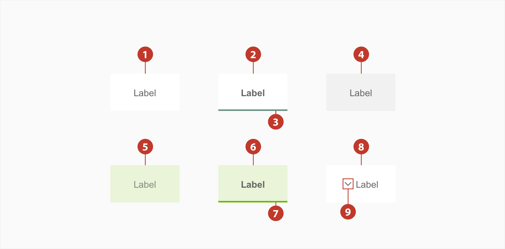

| Element | State              | Category    | Attribute                           | Value                                                 |
| ------- | ------------------ | ----------- | ----------------------------------- | ----------------------------------------------------- |
| 1.      | Normal             | Background  | Color Text-colour              | $color-white \$color-grey-800                    |
| 2.      | Active             | Background  | Color Text-colour              | $color-white \$color-grey-800                    |
| 3.      | Active             | Bottom Line | Color                               | \$color-sp-(sport_name)                               |
| 4.      | Hover              | Background  | Color Text-colour              | $color-grey-100 \$color-grey-800                 |
| 5.      | 2nd Level - Normal | Background  | Color Opacity Text-colour | $color-sp-(sport_name) 15% \$color-grey-800 |
| 6.      | 2nd Level - Active | Background  | Color Opacity Text-colour | $color-sp-(sport_name) 15% \$color-grey-800 |
| 7.      | 2nd Level - Active | Bottom Line | Color                               | \$color-sp-(sport_name)                               |
| 8.      | Show more          | Background  | Color Text-colour              | $color-white \$color-grey-800                    |
| 9.      | Show more          | Icon        | Color                               | \$color-grey-800                                      |

### Secondary

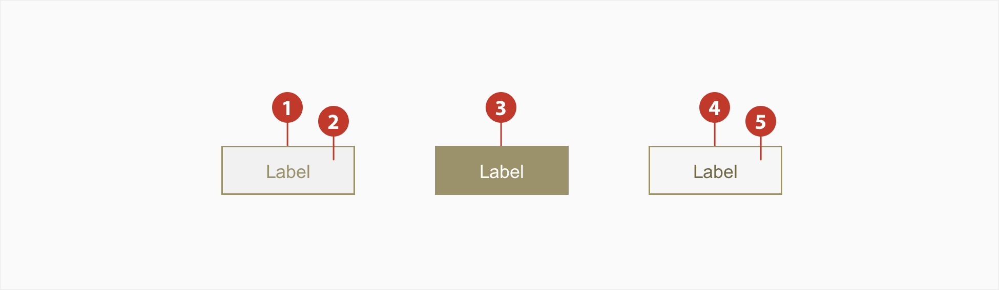

| Element | State  | Category   | Attribute              | Value                                         |
| ------- | ------ | ---------- | ---------------------- | --------------------------------------------- |
| 1.      | Normal | Border     | Color Border      | \$color-sp-horseracing-secondary 1px     |
| 2.      | Normal | Background | Color Text-colour | \$color-grey-100 #9B926C                 |
| 3.      | Active | Background | Color Text-colour | \$color-sp-horseracing-secondary #ffffff |
| 4.      | Hover  | Border     | Color Border      | \$color-sp-horseracing-secondary 1px     |
| 5.      | Hover  | Background | Color Text-colour | \$color-grey-50 #716945                  |

### Tertiary

| Element | State  | Category   | Attribute                           | Value                                                  |
| ------- | ------ | ---------- | ----------------------------------- | ------------------------------------------------------ |
| 1.      | Normal | Background | Color Text-colour              | \$color-grey-100 #9B926C                          |
| 2.      | Normal | Text label | Color                               | \$color-grey-800                                       |
| 3.      | Active | Background | Color Text-colour              | \$color-sp-horseracing-secondary #ffffff          |
| 4.      | Active | Text label | Color                               | \$color-grey-200                                       |
| 5.      | Hover  | Background | Color Text-colour              | \$color-grey-100 #9B926C                          |
| 6.      | Hover  | Text label | Color                               | \$color-grey-900                                       |
| 7.      | Focus  | Background | Color Opacity Text-colour | \$color-sp-horseracing-secondary 15% #9B926C |
| 8.      | Focus  | Text label | Color                               | \$color-grey-800                                       |

### Embedded

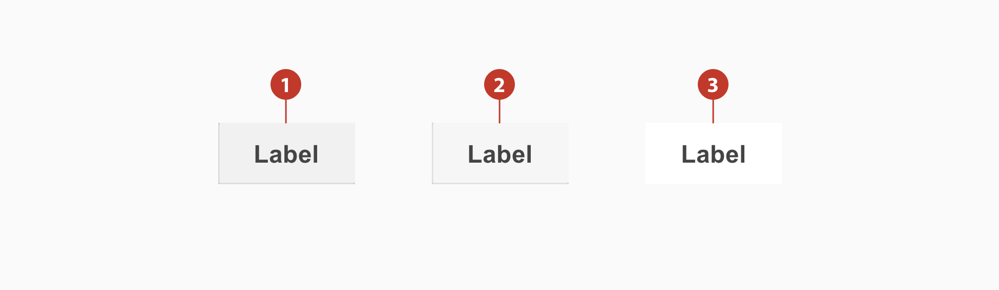

| Element | State  | Attribute                                                                                              | Value                                                                                                                                                               |
| ------- | ------ | ------------------------------------------------------------------------------------------------------ | ------------------------------------------------------------------------------------------------------------------------------------------------------------------- |
| 1.      | Normal | Background Inner-shadow-left Inner-shadow-right \* Inner-shadow-bottom Text-colour | \$color-grey-100 ​\$color-black 25%, X:1, Y:0, Blur:2 $color-black 25%, X:-1, Y:0, Blur:2 \$color-black 25%, X:0, Y:-1, Blur:2 \$color-grey-900 |
| 2.      | Hover  | Background Inner-shadow-left Inner-shadow-right \* Inner-shadow-bottom Text-colour | \$color-grey-50 \$color-black 25%, X:1, Y:0, Blur:2 $color-black 25%, X:-1, Y:0, Blur:2 \$color-black 25%, X:0, Y:-1, Blur:2 \$color-grey-900   |
| 3.      | Active | Background Text-colour                                                                            | \$color-white \$color-grey-900                                                                                                                                 |

**\*Note**: when the tab is placed at the left margin the `inner-shadow-left` is replaced by `inner-shadow-right`. In all other cases, the `inner-shadow-right` is not displayed.

## Typography

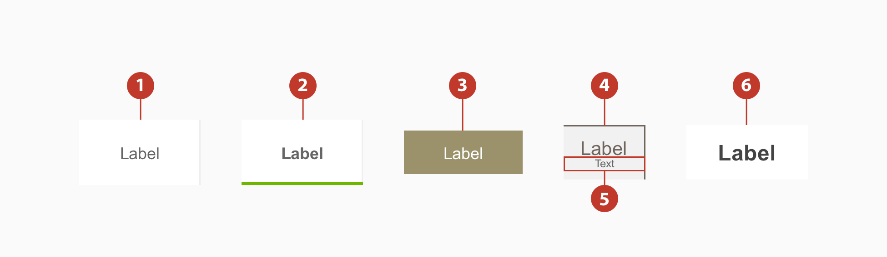

| Element | Category   | Attribute                                     | Value                                  |
| ------- | ---------- | --------------------------------------------- | -------------------------------------- |
| 1. & 3. | Small      | Typeface Font Size Line height | Arial Regular 12px 1.17 |
| 2.      | Small Bold | Typeface Font Size Line height | Arial Bold 12px 1.17    |
| 4.      | Medium     | Typeface Font Size Line height | Arial Bold 14px 1.14    |
| 5.      | xSmall     | Typeface Font Size Line height | Arial Regular 8px 1.25  |
| 6.      | Large Bold | Typeface Font Size Line height | Arial Bold 16px 1.25    |
