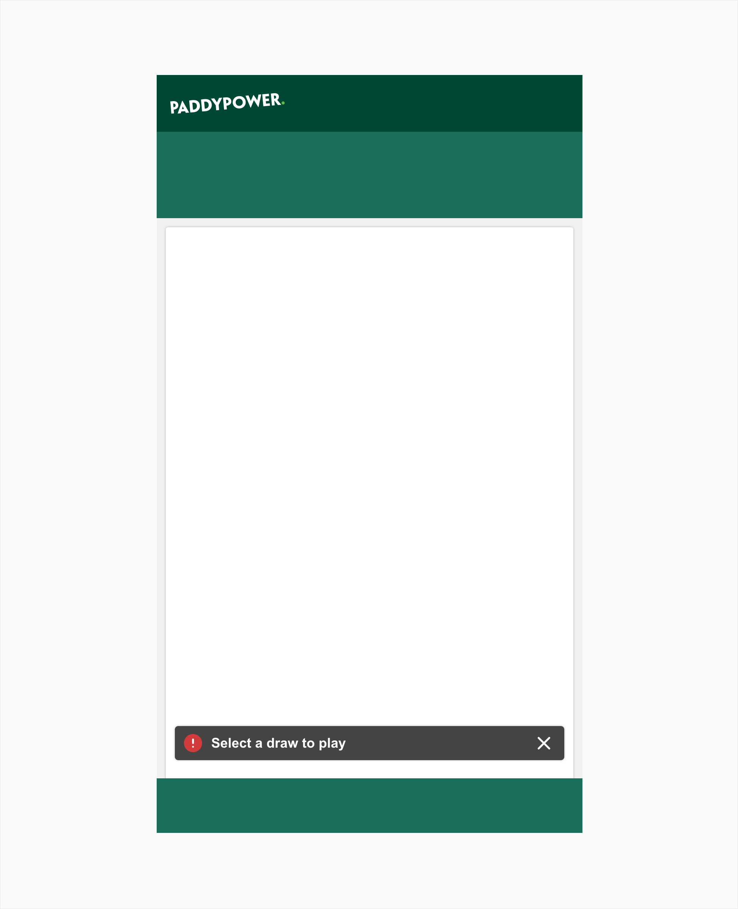
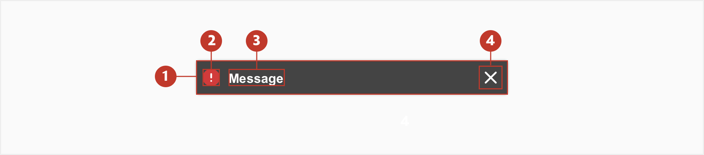
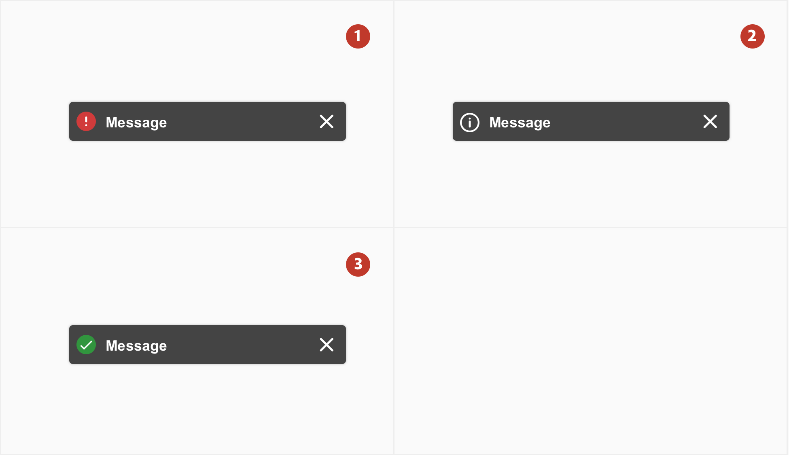
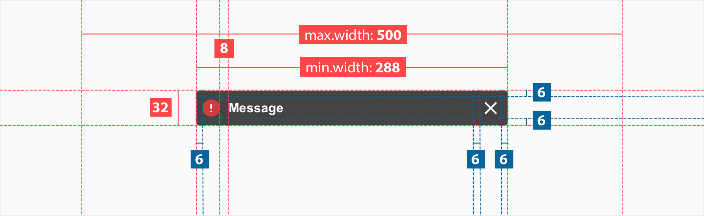
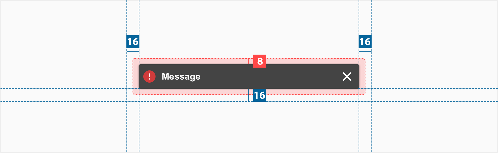
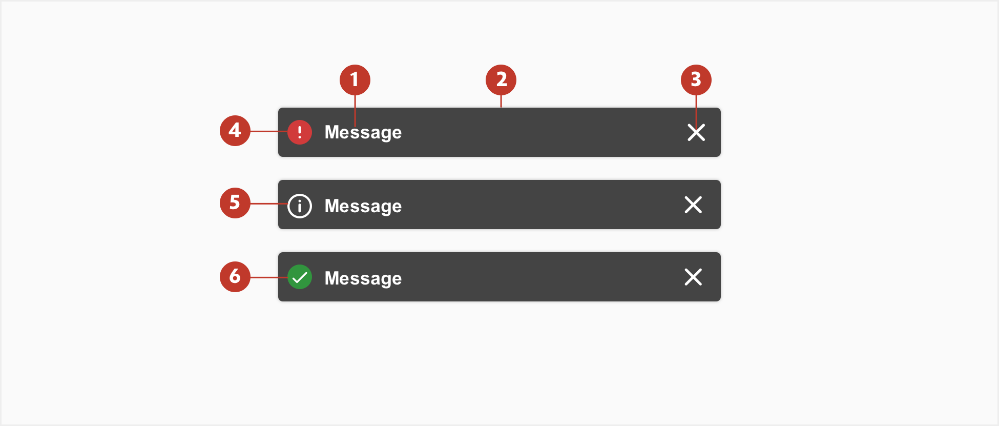

# Toast Notification

#### About Toast Notification

A toast is a container that displays feedback to the user.

The toast appears sliding from the bottom and fixed in the same position on top of any other contents. It can be configured to be dismissed in 3 different ways:

1. manually by taping the close button.
2. automatically after X seconds.
3. automatically after a predefined action.

#### Usage

#### Structure

A toast consists of the following:

1. **Container** - area bounding the content.
2. **Icon** - the icon and color represent the type of message that is being shown.
3. **Text** - the text should be clear, straight forward and as short as possible.
4. **Close (optional)** - close button to manually dismiss the toast.

#### Variations

1. **High severity** - display for high severity messages like errors that require the user's action.
2. **Low severity** - display for low severity messages like contextual supplementary information that doesn't require action.
3. **Success** - display to give feedback to the user when some action or task as been completed.

#### Specs

**Note:** The toast container has `border-radius:3px`.

#### Position

**Note:** The toast position is always centered and fixed to the bottom of the screen with a 16px margin. There is an 8px margin around the toast container to prevent users from clicking by mistake on the content on the background.

#### Colour

| Element | Category           | Attribute                          | Value                                                     |
| :------ | ------------------ | ---------------------------------- | --------------------------------------------------------- |
| 1.      | Text               | Colour                             | \$color-white                                             |
| 2.      | Background         | Background Drop shadow        | \$color-grey-925 \$color-black 25%, X:0, Y:0, Blur:2 |
| 3.      | Close button       | Icon                               | \$color-white                                             |
| 4.      | High severity icon | Background Icon               | $color-red-500 \$color-white                         |
| 5.      | Low severity       | Border Border-color Icon | 1px \$color-white \$color-white                 |
| 6.      | Success            | Background Icon               | $color-act-bg-secondary \$color-white                |
