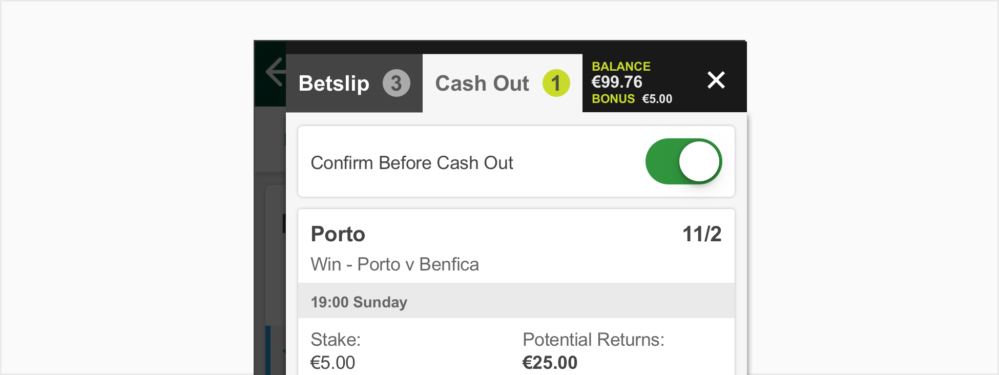
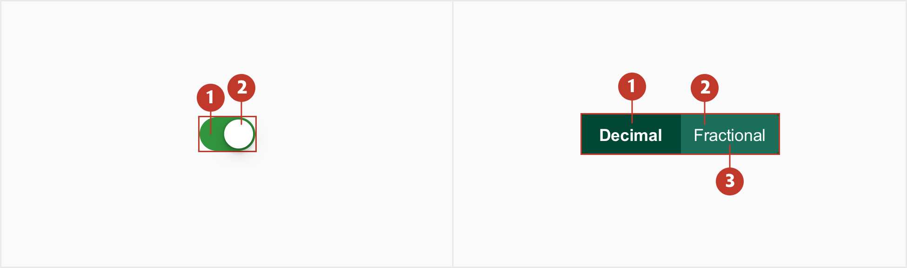
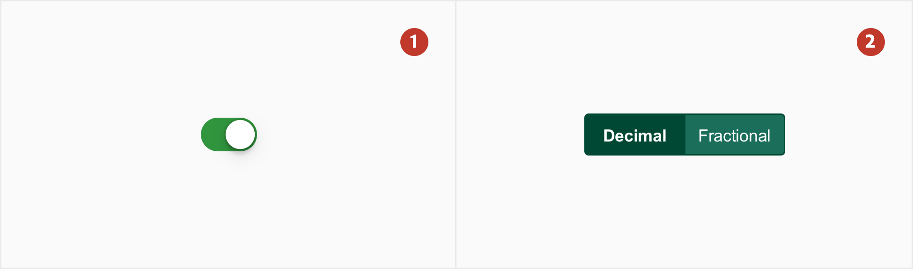
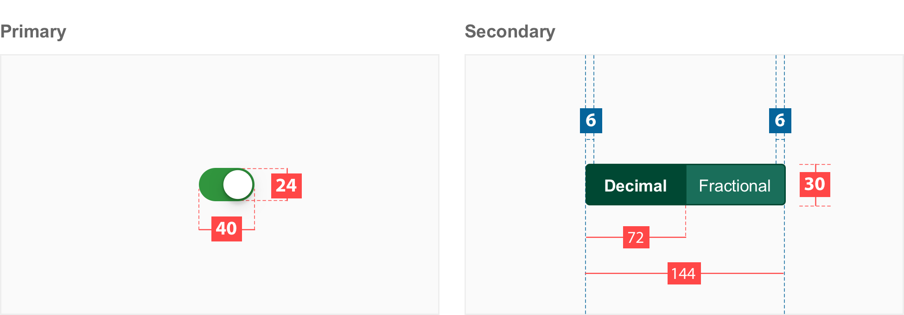
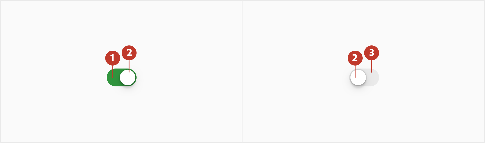

# Toggle

## **About Toggle**

Toggles are a quick way to switch between on and off states. Similar to a physical light switch Toggles are used to turn something on/off instantly. The options are mutually exclusive and always have a default state, enabled or disabled.

## Usage

When you need to provide a switch to turn something on or off (eg. Do you want odds in decimal or fractional?)

If a physical switch would work for the action a toggle is the best option.

**Use a toggle switch when:**

There are only 2 options to choose from, on or off.

To make decisions or a preference such as settings or dialogs.

## **Structure**

A toggle consists of the following:

3. **Toggle** **slot**- Area the toggle button sits into and slides in
4. **Button**- the piece of the toggle which moves side to side
5. **Label** - use labels with a Toggle so the action is clear. Labels should be three words or less.

## Types

1. **Primary** - Should be used most. Behaves like an on/off switch
2. **Secondary** - Use secondary when you are given two options to toggle between.

## Specs

## Colour

Toggles use custom colour on three elements: the background (active state), the background (inactive state) and the button.

| Element | Category              | Attribute                     | Value                                          |
| ------- | --------------------- | ----------------------------- | ---------------------------------------------- |
| 1.      | Background (active)   | Token Color Opacity | \$color-brand-secondary #31953e 100% |
| 2.      | Button                | Token Color Opacity | \$color-white #ffffff 100%           |
| 3.      | Background (inactive) | Token Color Opacity | \$color-grey-200 #eaeaea 100%        |

| Element | Category              | Attribute                     | Value                                        |
| ------- | --------------------- | ----------------------------- | -------------------------------------------- |
| 1.      | Background (active)   | Token Color Opacity | \$color-brand-primary #004833 100% |
| 2.      | Background (inactive) | Token Color Opacity | \$color-green-800 #1a6e5a 100%     |
| 3.      | Border                | Token Color Opacity | \$color-brand-primary #004833 100% |
| 4.      | Text                  | Token Color Opacity | \$color-white #ffffff 100%         |

## Typography

All toggles labels are set in sentence case and should not exceed three words.

| Element | Category    | Attribute                                     | Value                                   |
| ------- | ----------- | --------------------------------------------- | --------------------------------------- |
| 1       | Medium Bold | Typeface Font Size Line height | Arial Bold 12px 1.17     |
| 2       | Medium      | Typeface Font Size Line height | Arial  Regular 10px 1.17 |
