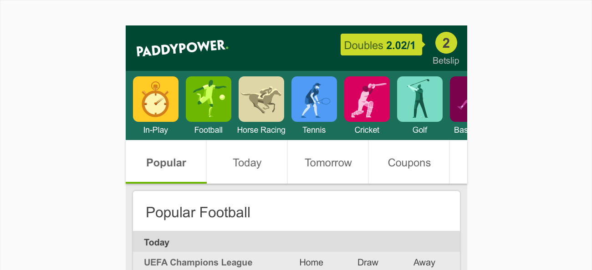
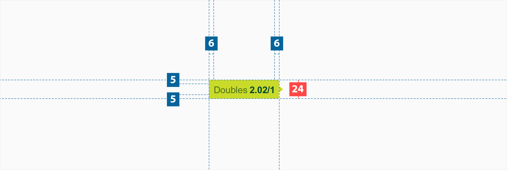

# Tooltip

## About Tooltip

A tooltip is a brief, informative message that appears when a user interacts with an element in a
graphical user interface .

## Usage

Use tooltips to add information to an element. Tooltips are used to give the user a better
understanding of what is happening on the page.

## Structure

An tooltip list comprises of the following:

1. **Container** - The area bounding the title and icon.

2. **Title**- the title should be short and concise
3. **Subtitle**-additional information beside the title if required.
4. **Tooltip arrow**- an arrow pointing in the direction the tooltip information is for.

## Specs

There is no current limit to the width of an open row, however, the padding specs above should be followed.

## Colour

| Element | Category  | Attribute                     | Value                                          |
| ------- | --------- | ----------------------------- | ---------------------------------------------- |
| 1.      | Container | Token Color Opacity | \$color-brand-highlight #C9DA2A 100% |
| 2.      | Title     | Token Color Opacity | \$color-green-700 #4C721D 100%       |
| 3.      | Subtitle  | Token Color Opacity | \$color-brand-primary #004833 100%   |
| 4.      | Arrow     | Token Color Opacity | \$color-brand-highlight #C9DA2A 100% |

## Typography

All tooltip labels are set in sentence case.

| Element  | Category    | Attribute                                     | Value                                   |
| -------- | ----------- | --------------------------------------------- | --------------------------------------- |
| Title    | Medium      | Typeface Font Size Line height | Arial  Regular 12px 1.17 |
| Subtitle | Medium Bold | Typeface Font Size Line height | Arial  Bold 10px 1.2     |
