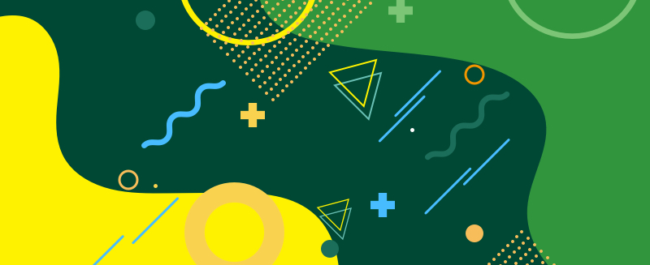

# Colour

The Paddy Power colour system can be used to create a color theme that reflects your brand or style.

## Acessibility

We committed to complying with, at least, AA standard contrast ratios. To do this, choose primary, secondary, and extended colors that support usability by ensuring sufficient color contrast between elements so that people with low vision can see and use the interface.

To make sure we are doing that we use:

1. [Stark↗](https://www.getstark.co/) - Sketch plugin to help design and build products that are accessible, ethical, and inclusive

2. [WebAIM↗](https://webaim.org/resources/contrastchecker/) - Colour contrast checker

[WCAG 2↗](http://www.w3.org/TR/WCAG20/) level AA requires a contrast ratio of at least 4.5:1 for normal text and 3:1 for large text, and a contrast ratio of at least 3:1 for graphics and user interface components (such as form input borders). Level AAA requires a contrast ratio of at least 7:1 for normal text and 4.5:1 for large text.

Large text is defined as 14 point (typically 18.66px) and bold or larger, or 18 point (typically 24px) or larger.

When in doubt, refer to the following guidelines:

- [WebAIM↗](http://webaim.org/)

- [Web Accessibility Initiative↗](https://www.w3.org/)

On the images below there is small A that represents normal text and a big A that represents large text that helps indicate whether a text color is legible in front of a background:

- A **PASS** badge indicates when white or black text is legible on a background color
- A **FAIL** badge indicates when white or black text is not legible on a background color

## Colour Palette

### Primary

<color-swatch-card background-color="#004833" palette-name="$color-brand-primary"></color-swatch-card>
<color-swatch-card background-color="#31953E" palette-name="$color-brand-secondary"></color-swatch-card>
<color-swatch-card background-color="#C9DA2A" palette-name="$color-brand-highlight"></color-swatch-card>

### Secondary

<color-swatch-card background-color="#FFF200" palette-name="$color-yellow-300"></color-swatch-card>
<color-swatch-card background-color="#1A6E5A" palette-name="$color-green-800"></color-swatch-card>

### Neutrals

#### Dark Neutrals

<color-swatch-card background-color="#000000" palette-name="$color-black"></color-swatch-card>
<color-swatch-card background-color="#444444" palette-name="$color-grey-900"></color-swatch-card>
<color-swatch-card background-color="#666666" palette-name="$color-grey-800"></color-swatch-card>

#### Midd Neutrals

<color-swatch-card background-color="#8D8D8D" palette-name="$color-grey-600"></color-swatch-card>
<color-swatch-card background-color="#AAAAAA" palette-name="$color-grey-500"></color-swatch-card>
<color-swatch-card background-color="#BBBBBB" palette-name="$color-grey-400"></color-swatch-card>

<color-swatch-card background-color="#DDDDDD" palette-name="$color-grey-300"></color-swatch-card>

#### Light Neutrals

<color-swatch-card background-color="#EAEAEA" palette-name="$color-grey-200"></color-swatch-card>
<color-swatch-card background-color="#EEEEEE" palette-name="$color-grey-150"></color-swatch-card>
<color-swatch-card background-color="#F1F1F1" palette-name="$color-grey-100"></color-swatch-card>

<color-swatch-card background-color="#F6F6F6" palette-name="$color-grey-50"></color-swatch-card>
<color-swatch-card background-color="#FFFFFF" palette-name="$color-white"></color-swatch-card>


## Sport Colour

### Brown Sport

<color-swatch-card background-color="#F2EABB" palette-name="$color-sp-beachvolley-primary"></color-swatch-card>
<color-swatch-card background-color="#DDCB5E" palette-name="$color-sp-beachvolley-secondary"></color-swatch-card>

<color-swatch-card background-color="#F2EABB" palette-name="$color-sp-volley-primary"></color-swatch-card>
<color-swatch-card background-color="#DDCB5E" palette-name="$color-sp-volley-secondary"></color-swatch-card>

<color-swatch-card background-color="#DFD6A8" palette-name="$color-sp-cheltenham-primary"></color-swatch-card>
<color-swatch-card background-color="#9B926C" palette-name="$color-sp-cheltenham-secondary"></color-swatch-card>

<color-swatch-card background-color="#DFD6A8" palette-name="$color-sp-grandnational-primary"></color-swatch-card>
<color-swatch-card background-color="#9B926C" palette-name="$color-sp-grandnational-secondary"></color-swatch-card>

<color-swatch-card background-color="#DFD6A8" palette-name="$color-sp-horseracing-primary"></color-swatch-card>
<color-swatch-card background-color="#9B926C" palette-name="$color-sp-horseracing-secondary"></color-swatch-card>

<color-swatch-card background-color="#BCAB99" palette-name="$color-sp-greyhoundracing-primary"></color-swatch-card>
<color-swatch-card background-color="#70655D" palette-name="$color-sp-greyhoundracing-secondary"></color-swatch-card>

<color-swatch-card background-color="#BAB100" palette-name="$color-sp-netball-primary"></color-swatch-card>
<color-swatch-card background-color="#776F05" palette-name="$color-sp-netball-secondary"></color-swatch-card>

### Green Sport

<color-swatch-card background-color="#C2F2B7" palette-name="$color-sp-gaahurling-primary"></color-swatch-card>
<color-swatch-card background-color="#89CC76" palette-name="$color-sp-gaahurling-secondary"></color-swatch-card>

<color-swatch-card background-color="#C2F2B7" palette-name="$color-sp-gaafoot-primary"></color-swatch-card>
<color-swatch-card background-color="#89CC76" palette-name="$color-sp-gaafoot-secondary"></color-swatch-card>

<color-swatch-card background-color="#7cc576" palette-name="$color-sp-americanfootball-primary"></color-swatch-card>
<color-swatch-card background-color="#409337" palette-name="$color-sp-americanfootball-secondary"></color-swatch-card>

<color-swatch-card background-color="#71AF80" palette-name="$color-sp-badminton-primary"></color-swatch-card>
<color-swatch-card background-color="#538C5F" palette-name="$color-sp-badminton-secondary"></color-swatch-card>

<color-swatch-card background-color="#B3D5CB" palette-name="$color-sp-multi-primary"></color-swatch-card>
<color-swatch-card background-color="#3A685B" palette-name="$color-sp-multi-secondary"></color-swatch-card>

<color-swatch-card background-color="#3B685B" palette-name="$color-sp-generic-primary"></color-swatch-card>
<color-swatch-card background-color="#699386" palette-name="$color-sp-generic-secondary"></color-swatch-card>

<color-swatch-card background-color="#6EB700" palette-name="$color-sp-euros-primary"></color-swatch-card>
<color-swatch-card background-color="#49951A" palette-name="$color-sp-euros-secondary"></color-swatch-card>

<color-swatch-card background-color="#6EB700" palette-name="$color-sp-football-primary"></color-swatch-card>
<color-swatch-card background-color="#49951A" palette-name="$color-sp-football-secondary"></color-swatch-card>

<color-swatch-card background-color="#16B03D" palette-name="$color-sp-bowls-primary"></color-swatch-card>
<color-swatch-card background-color="#127A28" palette-name="$color-sp-bowls-secondary"></color-swatch-card>

<color-swatch-card background-color="#99D95A" palette-name="$color-sp-hockey-primary"></color-swatch-card>
<color-swatch-card background-color="#14843C" palette-name="$color-sp-hockey-secondary"></color-swatch-card>

### Red Colour

<color-swatch-card background-color="#ED4D43" palette-name="$color-sp-poker-primary"></color-swatch-card>
<color-swatch-card background-color="#99302F" palette-name="$color-sp-poker-secondary"></color-swatch-card>

<color-swatch-card background-color="#FF4632" palette-name="$color-sp-lotto-primary"></color-swatch-card>
<color-swatch-card background-color="#BA2B24" palette-name="$color-sp-lotto-secondary"></color-swatch-card>

<color-swatch-card background-color="#E7133B" palette-name="$color-sp-snooker-primary"></color-swatch-card>
<color-swatch-card background-color="#9E0B35" palette-name="$color-sp-snooker-secondary"></color-swatch-card>

<color-swatch-card background-color="#BB3630" palette-name="$color-sp-aussie-primary"></color-swatch-card>
<color-swatch-card background-color="#600F0F" palette-name="$color-sp-aussie-secondary"></color-swatch-card>

<color-swatch-card background-color="#711429" palette-name="$color-sp-darts-primary"></color-swatch-card>
<color-swatch-card background-color="#A3193D" palette-name="$color-sp-darts-secondary"></color-swatch-card>

### Purple Colour

<color-swatch-card background-color="#FFCDD3" palette-name="$color-sp-athletics-primary"></color-swatch-card>
<color-swatch-card background-color="#EF788E" palette-name="$color-sp-athletics-secondary"></color-swatch-card>

<color-swatch-card background-color="#D9005F" palette-name="$color-sp-cricket-primary"></color-swatch-card>
<color-swatch-card background-color="#8C104B" palette-name="$color-sp-cricket-secondary"></color-swatch-card>

<color-swatch-card background-color="#AF2897" palette-name="$color-sp-powerplay-primary"></color-swatch-card>
<color-swatch-card background-color="#5B1955" palette-name="$color-sp-powerplay-secondary"></color-swatch-card>

<color-swatch-card background-color="#B59BC9" palette-name="$color-sp-pool-primary"></color-swatch-card>
<color-swatch-card background-color="#80679E" palette-name="$color-sp-pool-secondary"></color-swatch-card>

<color-swatch-card background-color="#804FAD" palette-name="$color-sp-noveltybets-primary"></color-swatch-card>
<color-swatch-card background-color="#644089" palette-name="$color-sp-noveltybets-secondary"></color-swatch-card>

### Blue Colour

<color-swatch-card background-color="#509BF5" palette-name="$color-sp-tennis-primary"></color-swatch-card>
<color-swatch-card background-color="#2B6FB2" palette-name="$color-sp-tennis-secondary"></color-swatch-card>

<color-swatch-card background-color="#509BF5" palette-name="$color-sp-wimbledon-primary"></color-swatch-card>
<color-swatch-card background-color="#2B6FB2" palette-name="$color-sp-wimbledon-secondary"></color-swatch-card>

<color-swatch-card background-color="#2B7AA7" palette-name="$color-sp-politics-primary"></color-swatch-card>
<color-swatch-card background-color="#215F84" palette-name="$color-sp-politics-secondary"></color-swatch-card>

<color-swatch-card background-color="#509BF5" palette-name="$color-sp-6nations-primary"></color-swatch-card>
<color-swatch-card background-color="#2B88BC" palette-name="$color-sp-6nations-secondary"></color-swatch-card>

<color-swatch-card background-color="#113F8C" palette-name="$color-sp-trianthlon-primary"></color-swatch-card>
<color-swatch-card background-color="#3387C1" palette-name="$color-sp-trianthlon-secondary"></color-swatch-card>

<color-swatch-card background-color="#003E7E" palette-name="$color-sp-rugbyunion-primary"></color-swatch-card>
<color-swatch-card background-color="#0088BE" palette-name="$color-sp-rugbyunion-secondary"></color-swatch-card>

### Turquoise Colour

<color-swatch-card background-color="#C2F6FF" palette-name="$color-sp-curl-primary"></color-swatch-card>
<color-swatch-card background-color="#3EAFB5" palette-name="$color-sp-curl-secondary"></color-swatch-card>

<color-swatch-card background-color="#6ACEE8" palette-name="$color-sp-swim-primary"></color-swatch-card>
<color-swatch-card background-color="#009BB5" palette-name="$color-sp-swim-secondary"></color-swatch-card>

<color-swatch-card background-color="#6ACEE8" palette-name="$color-sp-icehock-primary"></color-swatch-card>
<color-swatch-card background-color="#009BB5" palette-name="$color-sp-icehock-secondary"></color-swatch-card>

<color-swatch-card background-color="#79DBC3" palette-name="$color-sp-golf-primary"></color-swatch-card>
<color-swatch-card background-color="#1F7C61" palette-name="$color-sp-golf-secondary"></color-swatch-card>

<color-swatch-card background-color="#79DBC3" palette-name="$color-sp-usmasters-primary"></color-swatch-card>
<color-swatch-card background-color="#1F7C61" palette-name="$color-sp-usmasters-secondary"></color-swatch-card>

### Yellow Colour

<color-swatch-card background-color="#FCE75D" palette-name="$color-sp-common-wealth-primary"></color-swatch-card>
<color-swatch-card background-color="#F7DF3E" palette-name="$color-sp-common-wealth-secondary"></color-swatch-card>

<color-swatch-card background-color="#FFCB24" palette-name="$color-sp-inplay-primary"></color-swatch-card>
<color-swatch-card background-color="#DAA600" palette-name="$color-sp-inplay-secondary"></color-swatch-card>

<color-swatch-card background-color="#F1C40F" palette-name="$color-sp-cycle-primary"></color-swatch-card>
<color-swatch-card background-color="#D98A35" palette-name="$color-sp-cycle-secondary"></color-swatch-card>

<color-swatch-card background-color="#FFC764" palette-name="$color-sp-wrestling-primary"></color-swatch-card>
<color-swatch-card background-color="#B58B48" palette-name="$color-sp-wrestling-secondary"></color-swatch-card>

<color-swatch-card background-color="#F18D05" palette-name="$color-sp-virtuals-primary"></color-swatch-card>
<color-swatch-card background-color="#A85E05" palette-name="$color-sp-virtuals-secondary"></color-swatch-card>

<color-swatch-card background-color="#C97C54" palette-name="$color-sp-baseball-primary"></color-swatch-card>
<color-swatch-card background-color="#A83B0B" palette-name="$color-sp-baseball-secondary"></color-swatch-card>

## Notes

The name conventions were settled between the development and design teams with the goal of standardising their communication and Paddy Power visuals.

Colour names should have an objective name, instead of a qualitative/functional one.

The color names have the following template:

```SAS
	$<base color name>-<shade value>
```

The numbers are a measure of color saturation and are determined by the UI team.