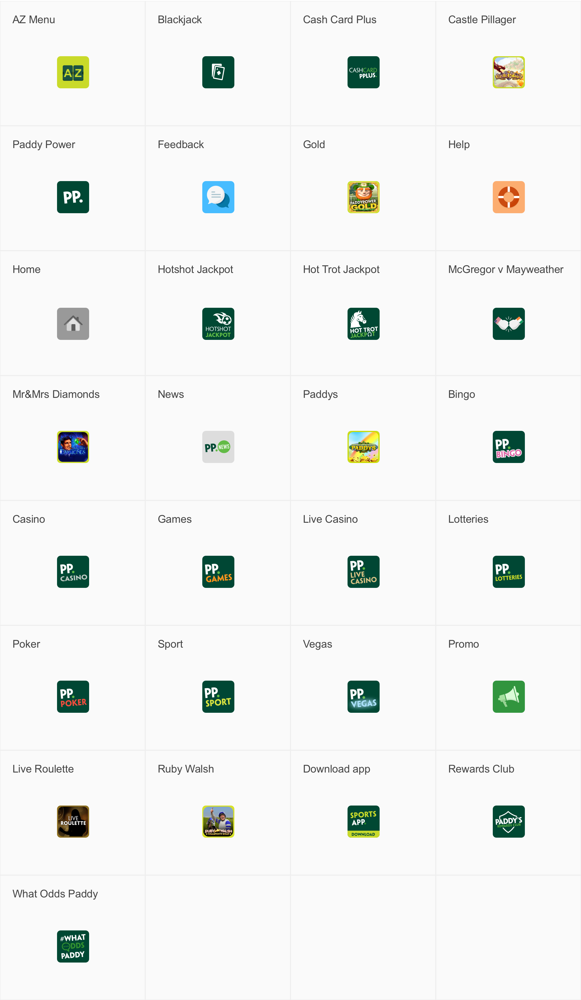
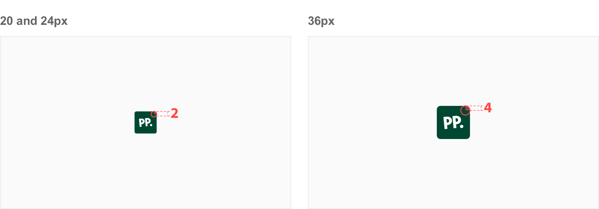
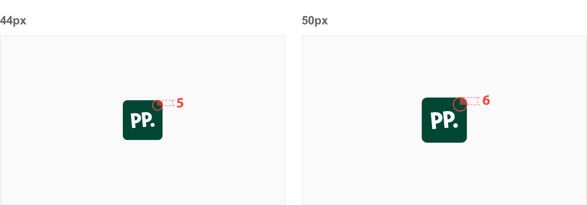

# Iconography

## About Product Icons

System icons communicate a message and should be distinct and informative. They should be simple, yet bold enough to grab attention, and leave a lasting impression.

### Navigation

### Social

## Usage

### Size

Locker Room components typically use icons on 36px artboards. Icons on 24px, 44px, and 50px artboards can also be used within the UI. Be sure icon size is consistent throughout your product.

### Corner radius

An icon’s corner radius consists of curved exterior corners.The recommended corner radius is different depending on the size of the icon used.

## Struture

To express a shared visual language, the graphic elements that make up a product icon should be consistent across all of a brand’s icons.

System icons are displayed as 36 x 36 px.

1. **Background** - The furthest back layer of the product icon
2. **Content** - The content should be clear e simple and always taking in account that needs to work in 5 different sizes.

Icon content should remain inside of the **live area**.

| Icon Size | Padding | Live Area | Corner Radius |
| --------- | ------- | --------- | ------------- |
| 20        | 2px     | 16px      | 2px           |
| 24        | 2px     | 20px      | 2px           |
| 36        | 2px     | 32px      | 4px           |
| 44        | 2px     | 40px      | 5px           |
| 50        | 2px     | 46px      | 6px           |

## Best practices

- All square & rectangle shapes should use a 2,4,5 e 6px border radius depending on the size of the shape.
- When scaling down icons, smaller elements like circles should be solid to help with legibility.
