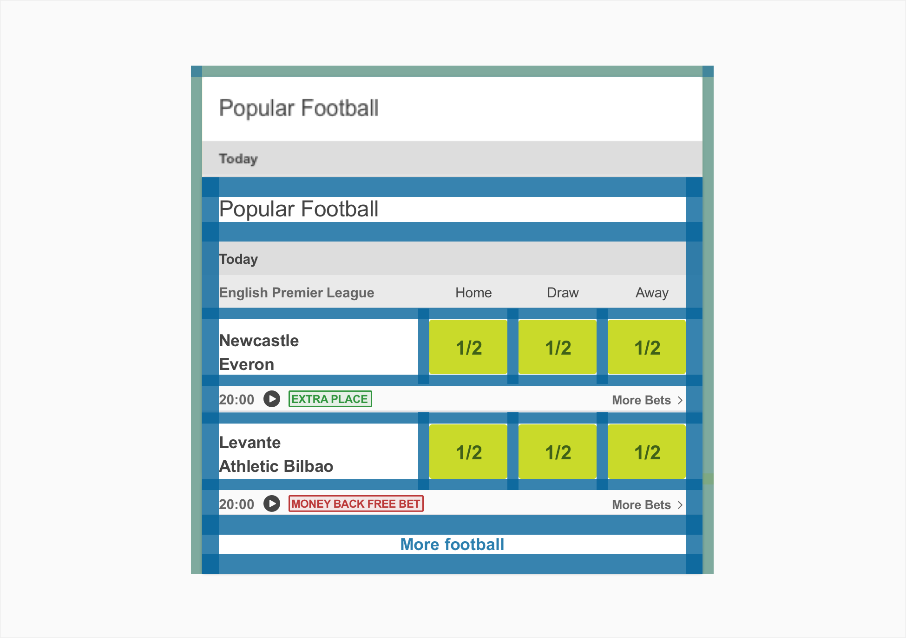
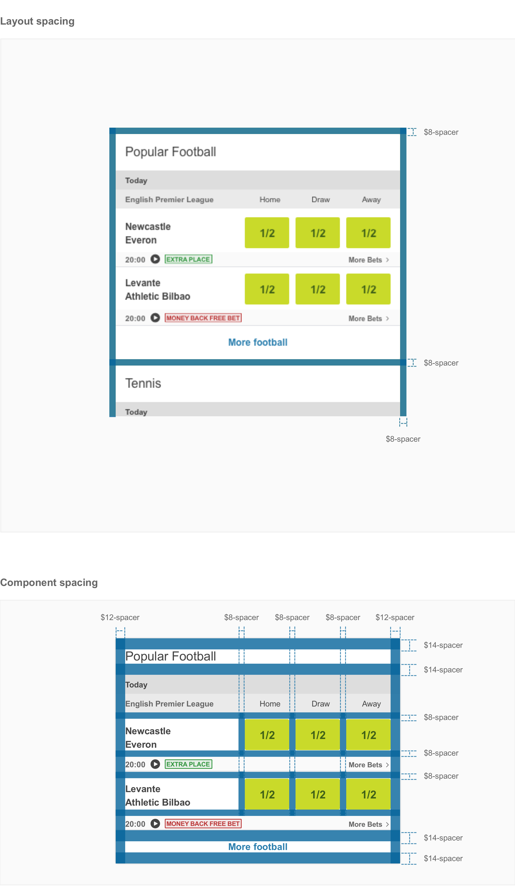
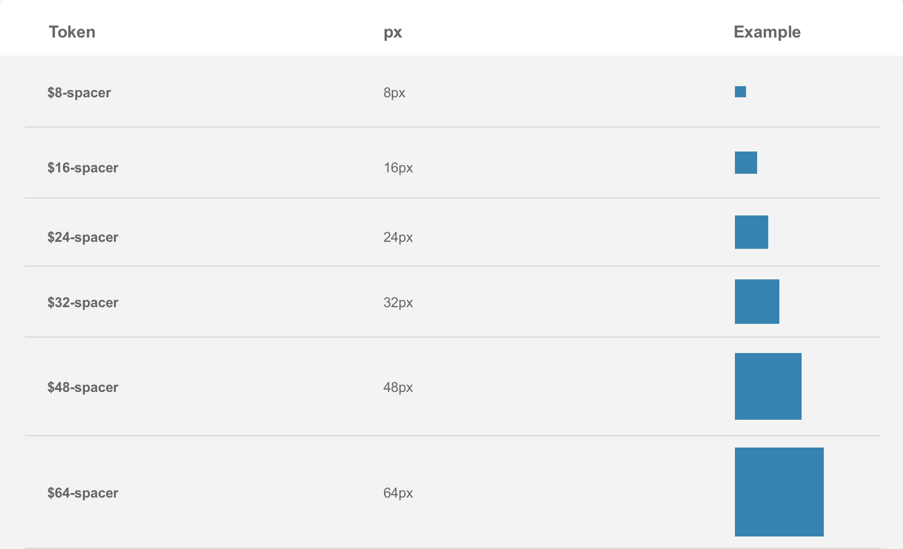
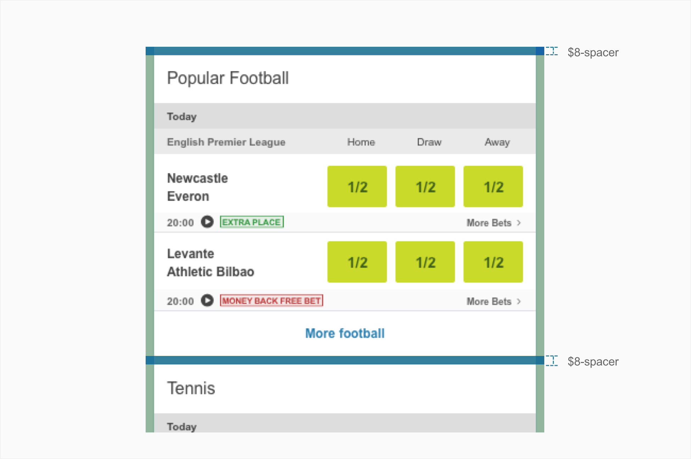

# Spacing

## About spacings

Spacing can be considered a breathing room of element’s boundary. You can add spacing to the top, bottom, left, and right of an element. You can apply the spacing values to one side, two complimentary sides, or to all four sides.

## Usage

Spacing can be applied to `margin` or `padding` properties. Likewise, these spacing tokens can be applied to both vertical and horizontal edges. The token takes the place of the values normally assigned to `margin` and `padding`.

## Types

We can consider there are two main groups of spacings one for spacing within components and the other for layout spacing. Both are designed to complement the existing components and typography throughout the our system. For that we use a horizontal and a vertical spacings system.

**Layout Spacings** - Spacing between screen edge and other elements should always respect 8px.

## Specs

Use the spacing system when building individual components or general layouts. It includes small increments needed to create appropriate detailed level designs. This scale is applied and used within all components and layouts.

A 8px/point rule should be the ideal spacing system used when possible. In cases where it is impossalbe to apply that rule we then use other spacings. (Ex:2px,4px,12px,14px)

## Vertical rhythm

We use a fixed 8px sizing scale to set vertical spacing between sections, by adding it to the top or bottom margin of a element or a component.

