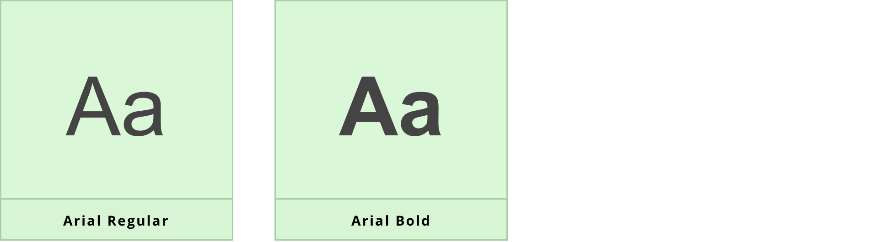
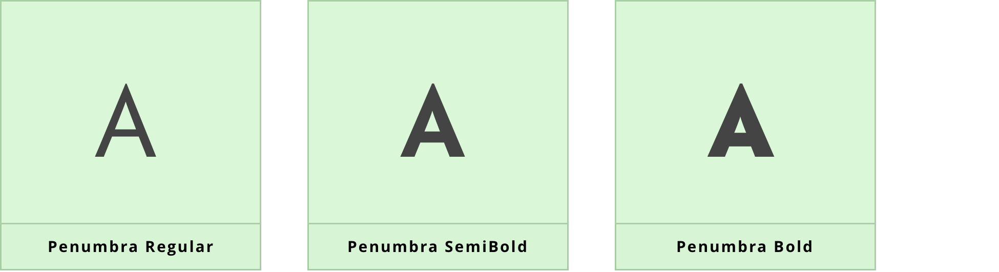
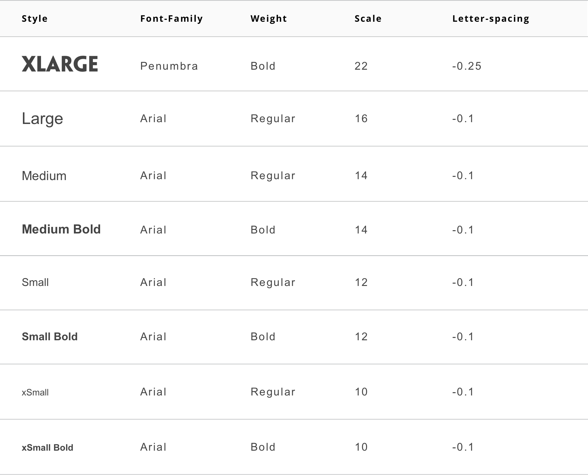
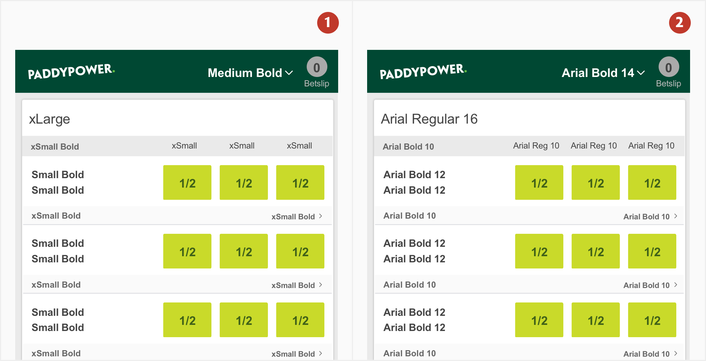
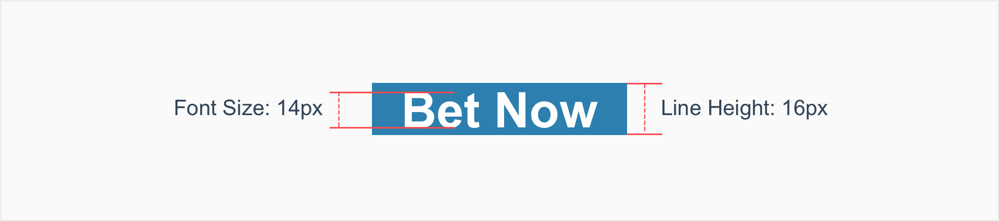
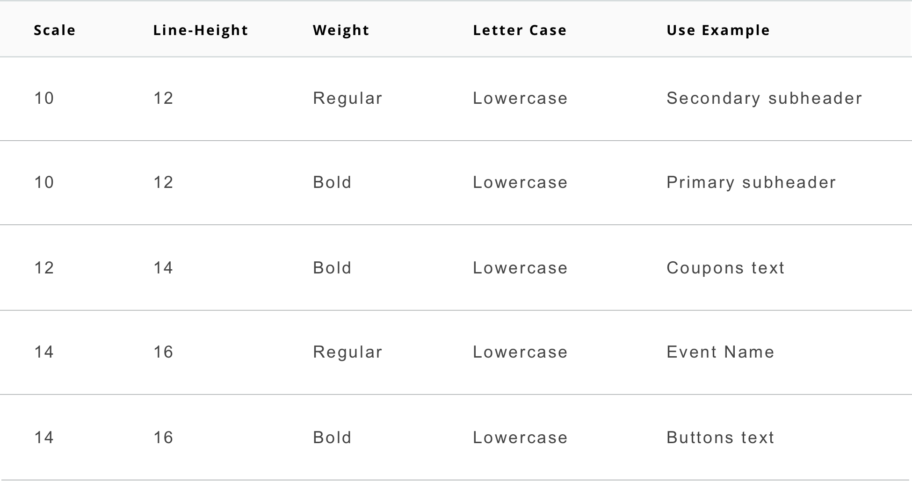

# Typography

## About typography

Keeping consist and sticking to logical hierarchies ensures that elements in the UI are clear and easily recognizable when scanning the page. Text sizes, styles, and layouts were selected to balance content and UI and to foster familiarity.

## Usage

Text is the major channel for users to understand application content and complete their work, and a well designed font system will greatly enhance the user's reading experience and work efficiency.

### Base Font

While defining the font system for a visual system, we propose to start from the following five aspects:

1. Font Family

2. Font Weight

3. Font Scale

4. Line Height

5. Letter Spacing

## Type Style

### Primary typeface

Arial is the default typeface used for everything in all of the Paddy Power applications and the website.

### Brand typeface

Penumbra Sans is Paddy Power's primary typeface as it is a clear, distinctive and highly legible sans serif font, with its simple rounded characteristics acting as a strong visual link to the brand mark.

It is used on all applications where possible, for headings, or to give emphasis within text, as it is only available in upper case letters and in three weights: regular, semibold and bold.

## Type Scale

The type scale is a combination of 7 styles that are supported by the type system. It contains reusable categories of text, each with an intended application and meaning.

## Applying the type scale

1. Scale categories

2. Actual values

## Line-height

Line-height, traditionally known as leading, is one of several factors that directly contribute to readability and pacing of copy. Line-heights are based on the size of the font itself.

Line-heights for standard copy have two more pixeis than the font size. For example, a type at 14px would have a line-height of 16px.

## Type Styles

Font styles of Paddy Power are allocated to the various text elements:

- Header in Regular

- Subheaders in Regular

- Buttons and text buttons in Bold

- Body in Regular

The tables in this section show the format combinations that are available in Paddy Power, along with reference examples.

### Headings

## Body

